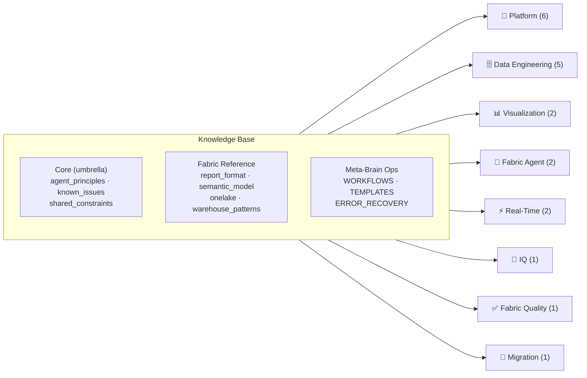

# Fabric-Brain

**20 Fabric-specific AI agents + 14 knowledge files for building Microsoft Fabric solutions — zero re-learning, zero repeated mistakes.**

> Part of the [**Azure-Brain**](../README.md) umbrella. For cross-cutting agents (testing, PPTX, architecture diagrams) see [`../Meta-Brain/`](../Meta-Brain/README.md).


---

## ⚡ Quick Start

**New here?** → [`../GETTING_STARTED.md`](../GETTING_STARTED.md) (15 min setup)

```bash
# 1. From Fabric-Brain/, configure local credentials
cp resource_ids.example.md resource_ids.md    # Fill with your Fabric IDs
cp environment.example.md environment.md      # Fill with your env paths

# 2. Open in VS Code with Copilot (umbrella .github/copilot-instructions.md auto-loads)

# 3. Pick a template and start building
# See ../Meta-Brain/TEMPLATES.md for step-by-step checklists
```

> **Key Rule** — The Fabric REST API accepts two report formats. Only one renders visuals.
> Always use the **Legacy PBIX format** (`report.json` with `sections[].visualContainers[]`). Never PBIR.

---

## 🎯 Pick Your Scenario

| I want to... | Template | Time | Start here |
| --- | --- | --- | --- |
| **Build a BI dashboard** (Lakehouse → Model → Report) | Standard BI Demo | 2–3h | [../Meta-Brain/TEMPLATES.md](../Meta-Brain/TEMPLATES.md#template-1) |
| **Set up real-time analytics** (EventStream → Eventhouse → KQL) | Real-Time IoT | 3–4h | [../Meta-Brain/TEMPLATES.md](../Meta-Brain/TEMPLATES.md#template-2) |
| **Build a full Smart Factory demo** (Batch + RT + Ontology + AI) | Smart Factory | 4–6h | [../Meta-Brain/TEMPLATES.md](../Meta-Brain/TEMPLATES.md#template-3) |
| **Add AI Q&A to existing data** (Data Agent + Instructions) | Data Agent Add-On | 45min | [../Meta-Brain/TEMPLATES.md](../Meta-Brain/TEMPLATES.md#template-4) |
| **Migrate from SAP BusinessObjects** (Assessment → Migration Waves) | BO Migration | 4–6w | [migration-bo-agent](agents/migration-bo-agent/) |

---

## 🤖 Agents (20) — 8 Domains

> Full catalog with boundary clarifications: [`agents/_catalog.yaml`](agents/_catalog.yaml)

### 🔧 Platform & Operations (6)

| Agent | What it does |
| --- | --- |
| [workspace-admin](agents/workspace-admin-agent/) | Workspace CRUD, capacity, RBAC, Git integration |
| [cicd-fabric](agents/cicd-fabric-agent/) | Git integration, deployment pipelines, variable libraries |
| [fabric-cli](agents/fabric-cli-agent/) | `fab` CLI, item management, CI/CD deploy |
| [monitoring](agents/monitoring-agent/) | Admin APIs, audit events, KQL dashboards |
| [taskflow](agents/taskflow-agent/) | Task Flow design, templates, JSON import/export |
| [extensibility-toolkit](agents/extensibility-toolkit-agent/) | Custom workloads, iFrame SDK, Workload Hub |

### 🗄️ Data Engineering (5)

| Agent | What it does |
| --- | --- |
| [orchestrator](agents/orchestrator-agent/) | Pipelines, ingestion, notebooks, copy jobs |
| [lakehouse](agents/lakehouse-agent/) | OneLake DFS, Delta tables, Spark, medallion architecture |
| [dataflow](agents/dataflow-agent/) | Dataflow Gen2, Power Query M, ETL |
| [warehouse](agents/warehouse-agent/) | Fabric Warehouse, T-SQL, CTAS, COPY INTO |
| [domain-modeler](agents/domain-modeler-agent/) | Star schema design, industry templates, synthetic data |

### 📊 Visualization (2)

| Agent | What it does |
| --- | --- |
| [semantic-model](agents/semantic-model-agent/) | DAX measures, relationships, model.bim, Direct Lake |
| [report-builder](agents/report-builder-agent/) | Power BI reports, visuals, themes (Legacy PBIX only) |

### 🤖 Fabric Agent (2)

| Agent | What it does |
| --- | --- |
| [ai-skills](agents/ai-skills-agent/) | Fabric Data Agents — creation, instructions, few-shot examples |
| [ai-skills-analysis](agents/ai-skills-analysis-agent/) | Data Agent evaluation, DAX quality scoring, RCA |

### ⚡ Real-Time Intelligence (2)

| Agent | What it does |
| --- | --- |
| [rti-kusto](agents/rti-kusto-agent/) | Eventhouse, KQL database, dashboards |
| [rti-eventstream](agents/rti-eventstream-agent/) | EventStreams, EventHub SDK, CDC patterns |

### 🧠 IQ — Intelligence (1)

| Agent | What it does |
| --- | --- |
| [ontology](agents/ontology-agent/) | Entity types, graph model, GQL queries, contextualizations |

### ✅ Fabric Quality (1)

| Agent | What it does |
| --- | --- |
| [pixel-design](agents/pixel-design-agent/) | Pre-deployment Fabric report validation — layout, overlaps, fonts |

### 🔄 Migration (1)

| Agent | What it does |
| --- | --- |
| [migration-bo](agents/migration-bo-agent/) | BusinessObjects → Fabric migration — 5-stage framework, 119 BO→DAX mappings |

> Cross-cutting agents (testing, PPTX, architecture diagrams, project orchestrator, project presentation) live in [`../Meta-Brain/agents/`](../Meta-Brain/README.md).
>
> Every agent has `instructions.md` (system prompt) + domain-specific files. The agent README lists the reading order.

---

## 📚 Knowledge Files

<details>
<summary><strong>Core — Read these first (at Azure-Brain umbrella root)</strong></summary>

| File | Purpose |
| --- | --- |
| [`../agent_principles.md`](../agent_principles.md) | **Mandatory** — Operating principles, task management, quality standards |
| [`../shared_constraints.md`](../shared_constraints.md) | 8 hard rules all agents follow (config-driven, idempotent, async-first) |
| [`fabric_api.md`](fabric_api.md) | REST API patterns, auth, async operations, LRO polling |
| [`../known_issues.md`](../known_issues.md) | Gotchas & workarounds. See also [`../ERROR_RECOVERY.md`](../ERROR_RECOVERY.md) |
| [`environment.md`](environment.md) | Python, Azure CLI, PowerShell setup |
| [`resource_ids.md`](resource_ids.md) | GUIDs, endpoints, connection strings |

</details>

<details>
<summary><strong>Reference — Domain-specific Fabric patterns</strong></summary>

| File | Purpose |
| --- | --- |
| [`report_format.md`](report_format.md) | **Critical** — Legacy PBIX format spec (the only format that renders) |
| [`visual_builders.md`](visual_builders.md) | Visual config, expression language, vcObjects |
| [`semantic_model.md`](semantic_model.md) | model.bim deployment, Direct Lake, TMDL |
| [`onelake.md`](onelake.md) | DFS API 3-step upload protocol |
| [`mcp_powerbi.md`](mcp_powerbi.md) | MCP Power BI — 21 tools for semantic model CRUD, DAX, Prep for AI |
| [`../Meta-Brain/mcp_registry.md`](../Meta-Brain/mcp_registry.md) | **MCP Server Registry** — central catalog of all 7 MCP servers |
| [`item_definitions.md`](item_definitions.md) | Definition envelope spec for all 20+ Fabric item types |
| [`warehouse_patterns.md`](warehouse_patterns.md) | SQL DW authoring — CTAS, COPY INTO, transactions, time travel |
| [`spark_patterns.md`](spark_patterns.md) | Spark/Lakehouse authoring — enableSchemas, notebooks, pools |
| [`mirrored_databases.md`](mirrored_databases.md) | Mirrored DB patterns — CDC sync, Lakehouse vs Mirror decision |

</details>

<details>
<summary><strong>Operations — Workflows, templates, error recovery (in Meta-Brain)</strong></summary>

| File | Purpose |
| --- | --- |
| [`../Meta-Brain/WORKFLOWS.md`](../Meta-Brain/WORKFLOWS.md) | 5 end-to-end cross-agent workflows with phases & gates |
| [`../Meta-Brain/TEMPLATES.md`](../Meta-Brain/TEMPLATES.md) | 5 project templates with checklists and time budgets |
| [`../ERROR_RECOVERY.md`](../ERROR_RECOVERY.md) | Decision trees by HTTP status, retry patterns |

</details>

---

## 🏗️ Architecture



---

## 📖 Documentation

| Doc | What's inside |
| --- | --- |
| [`../README.md`](../README.md) | **Azure-Brain umbrella** — vision and brain index |
| [`../GETTING_STARTED.md`](../GETTING_STARTED.md) | **Start here** — 15 min setup guide for new users |
| [`../Meta-Brain/TEMPLATES.md`](../Meta-Brain/TEMPLATES.md) | 5 project templates — pick one and follow the checklist |
| [`../Meta-Brain/WORKFLOWS.md`](../Meta-Brain/WORKFLOWS.md) | Cross-agent sequencing — phases, gates, handoffs |
| [`../ERROR_RECOVERY.md`](../ERROR_RECOVERY.md) | HTTP error decision trees + retry code examples |
| [`../shared_constraints.md`](../shared_constraints.md) | 8 hard rules every agent follows |
| [resource_ids.example.md](resource_ids.example.md) | Template for your workspace/item IDs |
| [environment.example.md](environment.example.md) | Template for your environment setup |

---

## License

MIT

Built for Microsoft Fabric. Part of [Azure-Brain](../README.md) — Fabric-Brain contains 20 specialized agents across 8 domains and 14 knowledge files.
