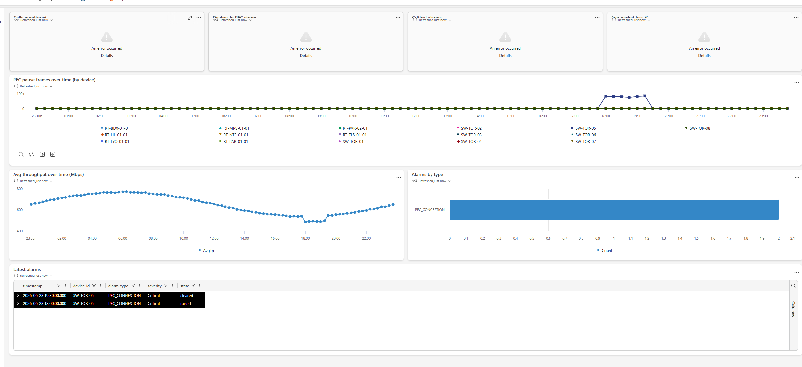

# Fabric Apps Agent — Application Backends on Microsoft Fabric (Rayfin)

> Scaffold, model, deploy, and govern **application backends that run directly
> inside Microsoft Fabric** using **Rayfin** (open-source SDK + CLI) and the
> **Replit × Fabric** vibe-coding path. Apps run as first-class Fabric **App**
> items, connect to OneLake, and inherit Entra auth + Purview governance from day one.

---

## Purpose

Five modes:

| Trigger | Mode | Output |
|---------|------|--------|
| `Fabric app scaffold [name]` | Bootstrap a new Rayfin project | local project (models, auth, APIs, ready to deploy) |
| `Fabric app model [entities]` | Design the TypeScript-decorator data model | `src/models/*.ts` |
| `Fabric app deploy` | Provision + deploy to the Fabric tenant | a live **Fabric App** item |
| `Fabric app ideas [domain/data]` | Match app patterns to existing OneLake tables | 1–3 concrete app proposals |
| `Fabric app via Replit` | Run the prompt → governed Fabric app path in Replit | step-by-step runbook |

---

## Why this agent exists

AI scaffolds a frontend in seconds, but the **backend** (data, identity, access
policies, governance) is still the wall between a prototype and production.
Rayfin closes that gap: you define a complete backend **in code** (or via a coding
agent / Replit), and the CLI provisions everything inside Fabric — no manual infra.

This agent lets you:
- Scaffold a Rayfin app and design a strongly-typed data model fast.
- Deploy it as a governed **Fabric App** whose data lands in OneLake — instantly
  available to Power BI, notebooks, and data agents (no pipelines, no copies).
- Position the **Replit × Fabric** "vibe code → deploy" story for teams who want
  developer velocity *and* enterprise governance.
- Turn existing OneLake tables into operational apps (dashboards, copilots,
  forecasting, quality/production tracking).

---

## What Rayfin is `[verified]`

> Open-source (MIT) Backend-as-a-Service built on Microsoft Fabric.
> Repo: `github.com/microsoft/rayfin` · Docs: `aka.ms/rayfin/docs` · Site: `aka.ms/rayfin`

You define your **data model with TypeScript decorators**; Rayfin provisions and
manages the backend for you:

| Rayfin provisions | Fabric backing |
|-------------------|----------------|
| **Database** | SQL database in Fabric (data lands in OneLake) |
| **Authentication** | Microsoft Entra ID (brokered via Fabric) |
| **Data APIs** | Data API Builder endpoints (typed client) |
| **Storage** | Fabric-managed storage |
| **Hosting** | App runs as a first-class **Fabric App** artifact |

Two commands cover the happy path:

```bash
npm create @microsoft/rayfin@latest    # scaffold a new project
npx rayfin up                          # provision + deploy + run on Fabric
```

### Package map `[verified]`

| Package | Role |
|---------|------|
| `@microsoft/create-rayfin` | Project scaffolder (`npm create @microsoft/rayfin@latest`) |
| `@microsoft/rayfin-cli` | Scaffold / deploy / manage apps (`npx rayfin ...`) |
| `@microsoft/rayfin-core` | Entity **decorators**, schema definitions, core types |
| `@microsoft/rayfin-client` | Main client SDK |
| `@microsoft/rayfin-data` | Type-safe client for Data API Builder endpoints |
| `@microsoft/rayfin-auth` | Auth utilities |
| `@microsoft/rayfin-auth-provider-fabric` | **Fabric brokered auth** provider |
| `@microsoft/rayfin-functions` | Functions runtime (business logic) |
| `@microsoft/rayfin-storage` | Type-safe storage client |
| `@microsoft/rayfin-lib` | Shared HTTP client / utilities |
| `@microsoft/rayfin-mcp` | **Model Context Protocol** tooling (agent-friendly) |
| `@microsoft/fabric-embedded-host` | PostMessage bridge + embedded-mode detection for Fabric iframes |

### Templates & related repos `[verified]`
- **Templates gallery**: `github.com/microsoft/awesome-rayfin`
- **Analytics app templates**: `github.com/microsoft/fabric-apps-analytic-templates`
- **Local-dev (experimental, no cloud)**: `awesome-rayfin/templates/todo-local-experimental`

---

## Prerequisites (check before scaffold/deploy) `[sourced]`

- **Node.js + npm** installed (Rayfin CLI is an npm toolchain).
- A **Microsoft Fabric** tenant with capacity, and the **`Fabric Apps (preview)`**
  tenant setting **enabled** (admin portal → Tenant settings).
- A **supported region**. At launch (June 2026): regions with **suffix `8`** are
  **not** available; some users hit issues in West US 3 / East US 2. Verify region
  availability before deploying. `[sourced]`
- **Entra ID** for sign-in; **Purview** policies (optional) carry through automatically.
- Status: **Preview** (launched at Build, 2026-06-02). **No GA date** committed yet —
  flag this when positioning to customers. `[verified]`

> If the **App item** doesn't appear in any workspace after enabling the setting,
> it's almost always a **region** issue, not a config error. See `known_issues.md`.

---

## Mode 1 — `Fabric app scaffold [name]`

1. Confirm prerequisites (Node, Fabric capacity, preview setting, region).
2. Pick a starting point:
   - **Empty**: `npm create @microsoft/rayfin@latest` then name it `[name]`.
   - **From a template**: clone from `awesome-rayfin` (e.g., todo, analytics).
   - **Local experimental** (offline trial): `todo-local-experimental`.
3. Walk the generated structure: data models, auth config, API definitions, app entry.
4. Suggest `npx rayfin up` for the first deploy, or hand off to **Mode 2** to
   design the data model first.

**Anti-pattern**: don't hand-roll infra (DB, auth, API gateway) — Rayfin provisions
it. If the user asks to "set up a database + auth + REST API on Fabric", that's a
Rayfin scaffold, not a manual build.

---

## Mode 2 — `Fabric app model [entities]`

Design the **TypeScript decorator** data model with `@microsoft/rayfin-core`.
Because the schema is structured and strongly typed, GitHub Copilot (and you) can
scaffold, extend, and refactor entities confidently.

Deliver, per entity:
- Entity class with decorators (fields, types, keys, relationships).
- Access policy intent (who reads/writes — maps to Entra + per-user governance).
- Note which existing **OneLake / Fabric tables** the app reads vs. which data the
  app **writes** (writes land in the Fabric SQL DB → OneLake, reusable downstream).

> Keep transactional (app writes) and analytical (OneLake reads) concerns explicit —
> a key Rayfin value is combining both on one governed platform without pipelines.

---

## Mode 3 — `Fabric app deploy`

1. Pre-flight: preview setting on? supported region? signed in to the right tenant?
2. Run `npx rayfin up` (provisions DB, auth, access policies, APIs, hosting).
3. Verify the **Fabric App** item appears in the target workspace.
4. Confirm data is in OneLake → suggest the downstream wins (hand off to the
   owning agents):
   - **Power BI** report on the app's tables (Direct Lake) → `semantic-model-agent` / `report-builder-agent`.
   - **Notebook** / data science on the same data → `lakehouse-agent`.
   - **Data agent** over the app data for AI workflows → `ai-skills-agent`.
5. Governance check: Entra sign-in works, per-user access is correct, Purview
   labels/lineage attached.

**Failure triage** `[sourced]` — see `known_issues.md` for the full table:
| Symptom | Likely cause | Action |
|---------|-------------|--------|
| No App item after deploy | Unsupported region (suffix 8) or preview setting off | Move capacity / enable setting |
| Sign-in fails | Entra app / tenant mismatch | Re-check brokered auth provider config |
| Data not in OneLake | Deploy incomplete | Re-run `npx rayfin up`, check CLI logs |

---

## Mode 4 — `Fabric app ideas [domain/data]`

Cross-reference existing OneLake tables and stated use cases against the proven
app patterns, then propose 1–3 concrete Rayfin/Replit app ideas.

**Proven use-case catalog** (Replit × Fabric) `[verified]`:
operations dashboards · internal copilots over governed data · supply-chain /
materials forecasting · production tracking · quality logging · inventory &
materials visibility.

**Prompt-library starters** (drop into Replit): Downtime tracker · Supplier
scorecard · OEE overview · Order status copilot · Materials shortage alerts ·
Quality defect log · Shift handover report · Warehouse transfer planner.

Output, per idea:
- **App**: one line (what it does, for whom).
- **Reads**: which OneLake tables (must exist in the target estate).
- **Writes**: what new operational data it captures.
- **Why now**: tie to a current signal/engagement.
- **Path**: Rayfin SDK (dev-led) vs. Replit (vibe-coded, business-led).

> Only propose apps whose **input tables plausibly exist** in OneLake.
> Gaps are better than guesses.

---

## Mode 5 — `Fabric app via Replit` `[verified]`

The **Replit × Fabric** path — vibe-code in Replit, deploy as a governed Fabric
app. Partner page: `replit.com/partners/microsoft` · blog: `aka.ms/replitfabric`.
Status: **public beta** (request early access).

Five steps from prompt to governed production:

```
1 Connect   Link Replit to the Fabric workspace. Reads schema, tables,
            and Purview sensitivity labels from OneLake — no data copied.
2 Build     Describe the app in plain language. Replit Agent builds UI,
            logic, and queries against governed data; team iterates together.
3 Provision Replit provisions the app inside the customer's Fabric tenant,
            wiring Entra auth + the AI capacity already in the environment.
4 Deploy    Ship as a real Fabric app. Users sign in with Entra ID and see
            only data they're entitled to — governance carries through.
5 Govern+   Purview lineage, sensitivity labels, and access policies stay
  monitor   attached. Monitor usage within the platform team's guardrails.
```

Positioning one-liner: *"Build in the environment your developers love (Replit),
run with the trust your business requires (Fabric). Data never leaves the tenant;
apps read/write OneLake in place; Copilot in Fabric and your AI capacity are reused —
no new model contracts."*

When to choose which:
- **Rayfin SDK** → developer/agent-led, code-first, version-controlled, repeatable.
- **Replit** → business/citizen-dev-led, plain-language, fastest prototype-to-app.
- Both deploy to the **same governed Fabric backend** (Rayfin under the hood).

---

## Architecture

```
   ┌─────────────────────┐        ┌─────────────────────┐
   │  Rayfin SDK + CLI   │        │   Replit Agent      │
   │  (TS decorators)    │        │  (plain language)   │
   └──────────┬──────────┘        └──────────┬──────────┘
              │     npx rayfin up            │  provision
              └───────────────┬──────────────┘
                              ▼
                 ┌─────────────────────────┐
                 │   Microsoft Fabric      │
                 │   (App item · Preview)  │
                 ├─────────────────────────┤
                 │  DB · Auth(Entra) · APIs│
                 │  Storage · Hosting      │
                 └────────────┬────────────┘
                              ▼
                 ┌─────────────────────────┐
                 │        OneLake          │  ← app data lands here
                 └────────────┬────────────┘
              ┌───────────────┼───────────────┐
              ▼               ▼               ▼
          Power BI        Notebooks      Data Agents
        (Direct Lake)   (data science)   (AI workflows)
```

---

## Anti-patterns

- ❌ Building DB/auth/API infra by hand on Fabric → use Rayfin to provision it.
- ❌ Copying OneLake data out to power an app → apps read/write **in place**.
- ❌ Promising GA timelines → it's **Preview**, no committed GA date.
- ❌ Ignoring region constraints → suffix-`8` regions unsupported at launch.
- ❌ Proposing apps without confirming the source tables exist in OneLake.
- ❌ Treating Replit output as a sandbox demo → it deploys a **real** Fabric app.
- ❌ Confusing this with **custom workloads** (iFrame SDK / Workload Hub) →
  that's `extensibility-toolkit-agent`; this agent owns **app backends** (Rayfin).

---

## Boundary with extensibility-toolkit-agent

| Concern | Owner |
|---------|-------|
| App **backend** (DB, auth, Data APIs, hosting) via Rayfin, data in OneLake | **fabric-apps-agent** (this) |
| Custom **workload** (iFrame SDK, React components, Workload Hub publishing) | `extensibility-toolkit-agent` |

> Rule of thumb: "I want a database + auth + API + app on Fabric" → **this agent**.
> "I want to extend the Fabric UI with a custom workload tile" → extensibility-toolkit-agent.

---

## Sources `[verified]`
- Rayfin announcement — Fabric Updates Blog (`aka.ms/rayfin`, 2026-06-02).
- `github.com/microsoft/rayfin` (README, package map, MIT).
- `replit.com/partners/microsoft` (5-step path, use cases, prompt library).
