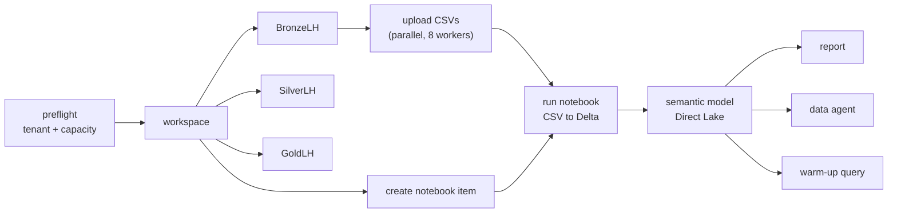

# Deployment Performance — Where the Time Actually Goes

> Companion to [`workspace_deployment_recipe.md`](workspace_deployment_recipe.md).
> The recipe says **what** to deploy and in **what order**. This file says how to stop it
> taking twenty minutes.

Read this before optimising anything. Most "Fabric is slow" reports are not Fabric being slow —
they are the deploy script sleeping, re-authenticating, and waiting on a Spark session it did
not need.

---

## 0. Rule zero — measure before you optimise

You cannot fix a budget you have not measured. Instrument every step before touching anything:

```python
import time, atexit
from contextlib import contextmanager

_TIMINGS: list[tuple[str, float]] = []

@contextmanager
def step(name: str):
    t0 = time.perf_counter()
    try:
        yield
    finally:
        _TIMINGS.append((name, time.perf_counter() - t0))

@atexit.register
def _report() -> None:
    if not _TIMINGS:
        return
    total = sum(d for _, d in _TIMINGS)
    print(f"\n{'step':<28}{'sec':>8}{'%':>7}")
    for name, d in sorted(_TIMINGS, key=lambda x: -x[1]):
        print(f"{name:<28}{d:>8.1f}{100 * d / total:>6.0f}%")
    print(f"{'TOTAL':<28}{total:>8.1f}")
```

Wrap each deploy step (`with step("lakehouse"): ...`). Optimise the top line only.
**Do not report a speed-up you have not measured on both sides.**

---

## 1. The typical budget

Order of magnitude for a demo-sized workspace (3 lakehouses, ~15 CSVs, 1 model, 1 report,
1 data agent), derived from figures already documented in this brain:

| Cost centre | Typical | Source | Compressible? |
|---|---:|---|---|
| Spark session cold start | 60s – 5 min | recipe L31, `spark_patterns.md` L277 | **Yes — often to zero** |
| Fixed polling sleeps (~12 async ops) | 60 – 90s | `helpers.py` polls `sleep(5)` **first**, flat | **Yes — to a few seconds** |
| Token acquisition (`az`, per script, per audience) | 10 – 20s | `subprocess` per `deploy_*.py` | **Yes — cache it** |
| OneLake upload, serial, 3 HTTP calls/file | 1 – 3s × N files | `_put()` loop, one connection | **Yes — parallelise** |
| TLS handshakes (no session reuse) | 0.3 – 0.5s × ~40 calls | bare `requests.get/post` | **Yes — one Session** |
| Actual Fabric item creation | 1 – 3s each | irreducible | No |
| Capacity resume (if paused) | 30 – 120s | ARM | No, but pay it **first** |

The first four lines are the ones your users are feeling. None of them is Fabric's fault.

> The equivalent work was already done on the Data Agent chat path and **measured**:
> `Session` + adaptive polling + parallel GETs took a 6-question run from **251.9s to 117.5s**
> (`../../fabric_api.md` → *Performance Optimizations*). The same three techniques were never
> applied to deployment. That is the gap this file closes.

---

## 2. Lever 1 — stop paying for a Spark session you do not need

**This is the single biggest win.** The recipe currently treats the CSV→Delta notebook as
mandatory, and its known-issues table says *"Spark notebook cold start → 60-90s | Normal — poll
until Completed"*. Accepting it as normal is what makes deployments feel slow.

### 2a. Decision tree

```
How much data are you loading?
├─ < ~1 GB, demo / reference build
│   └─ Write Delta directly from the deploy machine (no Spark at all)  → §2b
├─ 1 GB – 100 GB, or needs Spark SQL / MLlib
│   └─ Run Spark, but pay the cold start ONCE                          → §2c
└─ T-SQL Warehouse target rather than Lakehouse
    └─ COPY INTO — no Spark  (see ../../warehouse_patterns.md)
```

### 2b. Direct Delta write (removes the notebook step entirely)

For demo-sized data, `deltalake` (delta-rs) writes Delta straight to OneLake from the machine
running the deploy. No Spark session, no job polling, no cold start.

```python
from deltalake import write_deltalake
import pandas as pd

storage_options = {
    "bearer_token": storage_token(),      # https://storage.azure.com audience
    "use_fabric_endpoint": "true",
}
uri = f"abfss://{ws_id}@onelake.dfs.fabric.microsoft.com/{lh_id}/Tables/{schema}/{table}"
write_deltalake(uri, pd.read_csv(path), mode="overwrite", storage_options=storage_options)
```

> **STATUS: UNVALIDATED IN THIS BRAIN.** No trace here proves this against a Fabric tenant.
> Validate it on a throwaway workspace and record the result in `known_issues.md` before
> making it the default. Do not let anyone write "verified" next to it until then.

Two things to check when you validate:

1. **SQL analytics endpoint discovery.** Tables written outside Spark still have to be picked up
   by the Lakehouse SQL endpoint before a Direct Lake model can bind. If the model creation
   fails with a missing-table error, that lag is the cause — poll the endpoint for the table
   list before deploying the model, rather than sleeping a fixed amount.
2. **Schema-enabled lakehouses** need the `Tables/{schema}/{table}` path shape; non-schema ones
   use `Tables/{table}`.

If validation fails, fall back to §2c — but record *why*, so nobody retries this path blind.

### 2c. If you do need Spark, pay the cold start once

| Do | Don't |
|---|---|
| Keep the **default Starter Pool** (~15s warm-up) | Attach a custom Environment or Custom Pool to a demo notebook — that forces a non-pre-warmed session, 2–5 min (`spark_patterns.md` §Pool Options) |
| **One** notebook doing bronze→silver→gold | Three notebooks — three cold starts |
| Fire the notebook job **as soon as the CSVs land**, then deploy unrelated items while it warms | Wait idle for the job, then start deploying again |
| Use `notebookutils.notebook.run()` for sub-steps — same session | A separate job instance per step |

Firing the job early and overlapping it with other work is free: the Spark warm-up becomes
background time instead of wall-clock time.

---

## 3. Lever 2 — poll adaptively, and check before you sleep

The current helper sleeps **before** its first check, at a flat interval:

```python
for _ in range(max_wait // 5):
    time.sleep(5)                      # ← always costs 5s, even if the op finished in 300ms
    ...
```

Most item creations finish in well under a second. Across ~12 async operations that pattern
burns a minute of pure sleeping. Check first, then back off:

```python
POLL_SCHEDULE = [0, 0.4, 0.4, 0.8, 0.8, 1.5, 1.5, 3, 3] + [5] * 60

def poll_operation(session, api, op_id, headers, timeout=600, fetch_result=False):
    """Poll a Fabric LRO. Checks immediately, then backs off. Returns op (or its result)."""
    start = time.perf_counter()
    for delay in POLL_SCHEDULE:
        if delay:
            time.sleep(delay)
        if time.perf_counter() - start > timeout:
            break
        op = session.get(f"{api}/operations/{op_id}", headers=headers, timeout=30).json()
        status = op.get("status")
        if status == "Succeeded":
            if fetch_result:
                return session.get(f"{api}/operations/{op_id}/result",
                                   headers=headers, timeout=30).json()
            return op
        if status in ("Failed", "Cancelled"):
            raise RuntimeError(f"Operation {op_id} {status}: {op.get('error', {})}")
    raise TimeoutError(f"Operation {op_id} did not complete in {timeout}s")
```

Notes that matter:

- `fetch_result=False` by default. For `updateDefinition` the `/result` endpoint can hang
  (`../../fabric_api.md`) — only fetch the result when you actually need the payload.
- The tail stays at 5s. Long operations should not be hammered; the win is entirely at the
  short end.
- Keep the timeout generous for Spark job polling (`RunNotebook` legitimately takes minutes) —
  a tight timeout turns a slow deploy into a failed one.

---

## 4. Lever 3 — one HTTP session, one token per audience

Two cheap fixes, both already proven on the Data Agent path.

```python
import time, subprocess, requests

_TOKENS: dict[str, tuple[str, float]] = {}

def get_token(resource: str = "https://api.fabric.microsoft.com") -> str:
    """Cache tokens in-process. `az account get-access-token` costs 1-2s per call."""
    cached = _TOKENS.get(resource)
    if cached and time.time() < cached[1]:
        return cached[0]
    out = subprocess.check_output(
        ["az", "account", "get-access-token", "--resource", resource,
         "--query", "accessToken", "-o", "tsv"], shell=True)
    token = out.decode().strip()
    _TOKENS[resource] = (token, time.time() + 45 * 60)   # well inside the real lifetime
    return token

SESSION = requests.Session()          # TCP/TLS reuse across every call
SESSION.headers.update({"Content-Type": "application/json"})
```

`deploy_all.py` imports each step module and calls `main()` **in the same process**, so a
module-level cache is shared across all steps — as long as each step calls `get_token()`
instead of shelling out to `az` again.

> **OneLake DFS is the exception.** `requests`/`urllib3` hang against the DFS endpoint; the
> proven workaround is a raw `http.client.HTTPSConnection`. Keep `requests.Session` for the
> Fabric API and a pooled `HTTPSConnection` per worker for OneLake. Do not "simplify" this —
> the hang is real and already cost a debugging session.

---

## 5. Lever 4 — the deploy order is a graph, not a line

The recipe is written as a straight line 1→11. The real dependency graph is much wider, and
everything on the same rank can run concurrently:



What that buys you:

| Opportunity | How |
|---|---|
| 3 lakehouses at once | `ThreadPoolExecutor(max_workers=3)` over the create calls |
| N CSV uploads at once | 8 workers, **one `HTTPSConnection` per worker** (connections are not thread-safe) |
| Notebook item created while CSVs upload | Independent branches — submit both, join before `RUN` |
| Report **and** data agent after the model | Both depend only on the model; run them concurrently |

The one edge you must never break: **`RUN` before `SM`.** Direct Lake needs the Delta tables to
exist, otherwise the model fails with *"Direct Lake mode requires a Direct Lake data source"*.

Keep concurrency modest (≤8). Fabric rate-limits, and a 429 storm is slower than being patient —
`getDefinition` / `updateDefinition` are throttled more aggressively than plain reads.

---

## 6. Lever 5 — make re-runs nearly free

During demo prep the same workspace is deployed many times. A re-run should be seconds, not
minutes. Idempotency by *existence* is not enough — it still re-pushes definitions.

```python
import hashlib, json

def definition_hash(definition: dict) -> str:
    return hashlib.sha256(
        json.dumps(definition, sort_keys=True, separators=(",", ":")).encode()
    ).hexdigest()

# state.json: {"report": {"id": "...", "hash": "..."}}
if state.get(key, {}).get("hash") == definition_hash(definition):
    print(f"   {key}: unchanged, skipping updateDefinition")
else:
    push_definition(...)
    state[key] = {"id": item_id, "hash": definition_hash(definition)}
```

Same idea for uploads: skip a CSV whose size **and** content hash match what is recorded. And
skip the notebook run entirely when no source file changed — that alone removes the Spark step
from most re-runs.

Add `--force` to bypass all of it when you genuinely want a clean push.

---

## 7. Lever 6 — preflight, so you fail in 2 seconds instead of 4 minutes

Run these **before** step 1, in this order:

1. **Pin the tenant** — `az account set --subscription <sub>`. `az` silently flips to another
   tenant and every call then returns 404 EntityNotFound. Costs nothing, saves a confused hour.
2. **Resume the capacity and wait for `Active`.** A paused capacity makes everything either
   fail or crawl. Resume is 30–120s — pay it once, up front, not discovered halfway through.
3. **Validate the configs** (the project's own test gate) — a typo in a measure name should
   fail before the workspace is created, not after the report is deployed.
4. **Acquire all three tokens once** (Fabric, storage, ARM) and cache them.

---

## 8. Anti-patterns — fast-looking changes that make things worse

| Tempting | Why it backfires |
|---|---|
| Drop polling and just `sleep(30)` | Works until it doesn't; failures become silent and undiagnosable |
| Crank concurrency to 32 | 429 storms; total wall-clock goes **up**, and retries hide real errors |
| Reuse one `HTTPSConnection` across threads | Not thread-safe — interleaved responses, corrupted uploads |
| Shrink the notebook-job timeout to "fail fast" | Spark legitimately takes minutes; you convert slow into broken |
| Skip the warm-up query to save 5s | You move the latency onto the live demo, in front of the customer |
| Cache tokens to disk | Credential leak for a 1–2s saving. In-process only. |

---

## 9. Priority order

Do them in this order — descending value, ascending risk:

| # | Change | Expected effect | Risk |
|---|---|---|---|
| 1 | Instrument every step (§0) | none, but everything below depends on it | none |
| 2 | Check-first adaptive polling (§3) | removes most fixed sleep time | low |
| 3 | Token cache + `requests.Session` (§4) | removes repeated `az` and TLS cost | low |
| 4 | Preflight: tenant + capacity (§7) | turns late failures into instant ones | low |
| 5 | Parallel uploads + parallel lakehouses (§5) | compresses the I/O-bound stretch | medium |
| 6 | Content-hash idempotency (§6) | makes re-runs near-instant | medium |
| 7 | One notebook, Starter Pool, fired early (§2c) | cold start paid once, in the background | medium |
| 8 | Direct Delta write, no Spark (§2b) | **removes the largest single cost** | high — unvalidated |

Items 2–4 are mechanical and safe. Do them first, re-measure, and only then decide whether
items 7–8 are worth the validation effort for your data sizes.

---

## 10. Validation status

Honesty gate — this brain does not claim "verified" without a trace (`../../../AGENTS.md` rule 9).

| Claim | Status |
|---|---|
| `Session` + adaptive polling + parallel GET cut a Data Agent run 251.9s → 117.5s | **Measured** — `../../fabric_api.md` |
| Current deploy helper sleeps 5s before its first poll check | **Verified by inspection** of shipped `helpers.py` |
| OneLake uploads are serial, one file at a time | **Verified by inspection** of shipped `deploy_lakehouse.py` |
| Starter Pool ~15s vs Custom Pool 2–5 min | **Documented** — `../../spark_patterns.md`, not re-measured here |
| Adaptive polling applied to *deployment* saves ~1 min | **Estimated** from op counts — not yet measured end to end |
| Direct Delta write via delta-rs removes the Spark step | **Unvalidated** — no trace against a tenant |

When you measure any of these, update this table and add the trace to `known_issues.md`.
