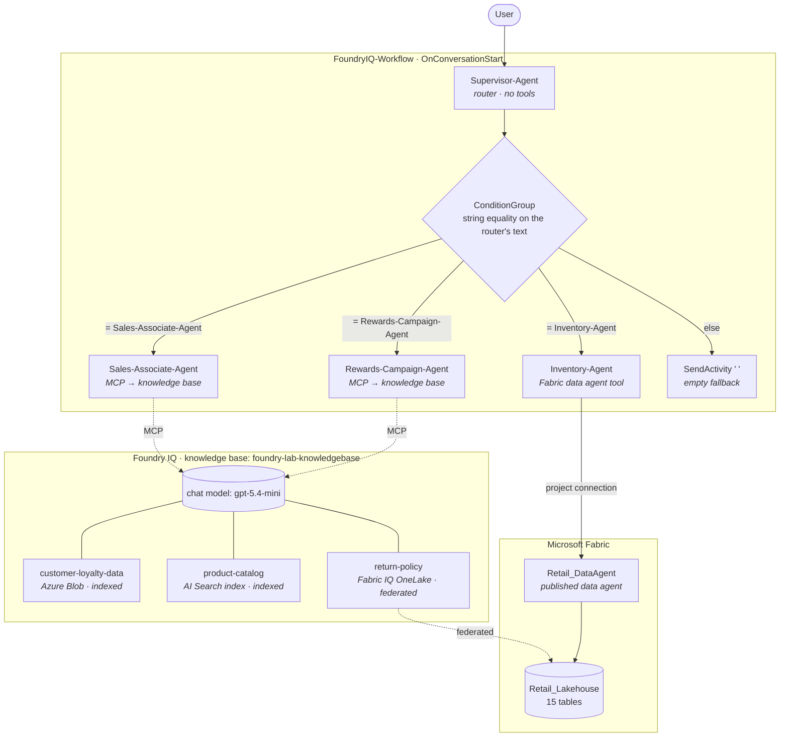

# Reference implementation — Foundry IQ over Fabric (Zava retail)

> **What this is.** A complete, observed, end-to-end Foundry system: four agents, a Foundry IQ
> knowledge base with three heterogeneous sources, a Fabric data agent called as a tool, and a
> workflow that routes between them. Captured from the Microsoft **"Building Foundry IQ"** lab
> on 2026-08-04.
>
> **What it is for.** Reuse. This is the skeleton to start from when a customer asks for
> "agents over our data" — every part of it was seen working, and every weakness in it is
> written down below.
>
> **Companion:** [`reference_workflow.md`](reference_workflow.md) — a *different* observed system
> (Microsoft 365 / Work IQ, seven agents, nested routers). The two are worth reading together;
> the comparison at the end of this file is where most of the transferable insight lives.
>
> **Raw source:** [`labs/foundry-iq/raw_capture.md`](labs/foundry-iq/raw_capture.md).

---

## The system



Four agents. One knowledge base. One Fabric artifact. One workflow. That is the whole system.

---

## The stack, layer by layer

| Layer | What was built | Owned by |
|---|---|---|
| **Data** | `Retail_Lakehouse` — 15 tables (orders, order_lines, customers, products, inventories, shipments, returns, forecasts, promotions, regions, stores, warehouses, carriers, product_categories, demand_signals) | `Fabric-Brain/agents/lakehouse-agent` |
| **Semantic** | `Retail_DataAgent` — a published Fabric data agent over all 15 tables, with its own instructions defining `Revenue`, `Sales Volume`, `Return Rate`… | `Fabric-Brain/agents/ai-skills-agent` |
| **Models** | `gpt-5.4-mini` (chat) + `text-embedding-ada-002` (embeddings), both *Default settings* | `foundry-project-agent` *(planned)* |
| **Knowledge** | `foundry-lab-knowledgebase` — 3 sources, backed by an Azure AI Search resource | `foundry-knowledge-agent` |
| **Tools** | one Fabric data agent connection (`fabriciq_dataagent`), one MCP tool to the knowledge base | `foundry-tools-agent` |
| **Agents** | 4 — created by a Python script, not by hand | `foundry-agent-service-agent` |
| **Orchestration** | `FoundryIQ-Workflow` — YAML, string-equality routing | `foundry-orchestration-agent` |
| **Governance** | a guardrail across all agents; an evaluation run on the supervisor; traces to App Insights | `foundry-governance-agent`, `foundry-observability-agent` |

---

## The four agents

| Agent | Role | Tools | Output | Consumed by |
|---|---|---|---|---|
| `Supervisor-Agent` | **Router** | *none* | one bare agent name | string equality in the workflow YAML |
| `Sales-Associate-Agent` | Action / advisor | MCP → knowledge base | conversational recommendations with product fields | the user |
| `Rewards-Campaign-Agent` | Resolver | MCP → knowledge base | **JSON** (`answer`, `discount_percentage`) | a caller, by contract |
| `Inventory-Agent` | **Wrapper** | Fabric data agent | pass-through of the tool's rows | the user |

Note the shape of it: **the agent that decides holds no tools**, and each specialist holds
exactly one capability. That property is free and it removes a whole class of failure.

### The router contract, confirmed twice independently

```
Output Format
Return only the agent name no extra space or new line simple string. We want for example:
Sales-Associate-Agent
```

A second lab, a different domain, a different author — and the same clause. This is not a style
preference. It is a **type contract**, because the workflow does:

```
=Last(Local.Var5755).Text = "Sales-Associate-Agent"
```

Exact string equality. A trailing newline breaks the system. That is why the prompt is written
that way, and it is the single most transferable line in either lab.

---

## The workflow

```yaml
kind: workflow
trigger:
  kind: OnConversationStart
  actions:
    - kind: SetVariable                     # ⚠ written, never read
      variable: Local.Var2679
      value: =System.LastMessage
    - kind: InvokeAzureAgent
      agent: { name: Supervisor-Agent }
      output: { autoSend: true, messages: Local.Var5755 }
    - kind: ConditionGroup
      conditions:
        - condition: =Last(Local.Var5755).Text = "Sales-Associate-Agent"
          actions: [ InvokeAzureAgent → Sales-Associate-Agent,  autoSend: true ]
        - condition: =Last(Local.Var5755).Text = "Rewards-Campaign-Agent"
          actions: [ InvokeAzureAgent → Rewards-Campaign-Agent, autoSend: true ]
        - condition: =Last(Local.Var5755).Text = "Inventory-Agent"
          actions: [ InvokeAzureAgent → Inventory-Agent,        autoSend: true ]
      elseActions:
        - kind: SendActivity
          activity: " "                     # ⚠ silent empty fallback
name: FoundryIQ-Workflow
```

| Element | What it does |
|---|---|
| `OnConversationStart` | the only trigger observed in either lab |
| `=System.LastMessage`, `=Last(...)` | **Power Fx** expressions |
| `Local.VarNNNN` | workflow-scoped variables; the numeric suffix is generated, not meaningful |
| `autoSend` | whether that agent's output reaches the **user** |
| `ConditionGroup` | flat `if / else if / else` — no loops, no parallelism |

---

## ⚖️ Two labs, one mechanism, opposite strategies

This is the most useful thing to come out of reading both systems together.

| | **FoundryIQ-Workflow** (this file) | **Microsoft-IQ-Workflow** ([`reference_workflow.md`](reference_workflow.md)) |
|---|---|---|
| Agents | 4 | 7 |
| Router depth | 1 level | **2 levels** — routers nest |
| `autoSend` | `true` **everywhere** | `true` on **exactly one** agent (the synthesizer) |
| The user sees | every hop, including the router's bare agent name | one composed answer |
| Final step | none — the branch's output *is* the answer | a dedicated **Summarizer-Agent** |
| `else` branch | `SendActivity " "` — silence | `SendActivity Local.Var4471` — leaks the router's raw output |
| Agent creation | **Python script** (`create_version`) | portal, by hand |

**The transferable rule:** `autoSend` is the entire implementation of "who speaks". Two teams
made opposite choices with the same flag.

- `autoSend: true` everywhere → the user watches the machine think. Good for a **demo of the
  architecture**, bad for a product: the router's raw `"Inventory-Agent"` appears in the chat.
- `autoSend: true` once, on a synthesizer → six agents run, one voice answers. Good for a
  **product**, and it hides the very thing a demo wants to show.

Decide which of the two you are building **before** you write the YAML, because it is a one-flag
change and nobody will notice it in review.

---

## 🎬 Demo script — four beats

**Beat 1 — the data already means something.**
Open the Fabric data agent's instructions and show the *Terminology Standardization* block:
`Revenue = Sum(order_lines.LineTotalAmount)`. The business definition lives with the data, not in
the agent that quotes it. Ask *"Which regions are underperforming in sales?"* in Fabric.

**Beat 2 — three kinds of knowledge, one knowledge base.**
Show the three sources side by side: a blob container of documents (**indexed** — a copy is
embedded), an existing AI Search index (**indexed** — reused as-is), and a Fabric lakehouse
(**federated** — no data movement). One knowledge base, three very different residency answers.
This is the slide a CISO actually wants.

**Beat 3 — the money line.**
Run the workflow with *"Can you tell me Joe's customer loyalty tier and discount?"*, then open the
YAML. Say it plainly:

> **The supervisor returns a word. The workflow does an `if/else` on that word.**

There is no magic router. Routing is `=Last(Local.Var5755).Text = "Rewards-Campaign-Agent"` —
string equality — which is exactly why the supervisor's prompt says *"no extra space or new
line"*. Then show the JSON that comes back from the rewards agent: an agent whose consumer is a
machine emits a machine shape.

**Beat 4 — it is governed, and you can prove it.**
Force a tool call and let the **approval prompt** appear on screen: the concrete call, its
arguments, `Approve once / Always approve this tool / Deny`. Then open **Traces** and walk one
conversation ID. Finish on **Guardrails** — jailbreak and protected-materials controls applied
across every agent at once.

> Beat 4 is where the demo stops being a chatbot demo.

---

## ⚠️ Four weaknesses to fix before reusing this

They are all real, all in the observed system, and all cheap to fix.

### 1. Business data hardcoded in a grounded agent's prompt

`Inventory-Agent` is told *"The response must come only from the Fabric Data Agent tool output"* —
and then given a literal list of ten product IDs "at risk of stockout".

Those clauses contradict each other. It makes the demo deterministic and the agent wrong the day
inventory changes. **Delete the list.** A grounded agent with hardcoded facts is worse than an
ungrounded one, because it looks sourced.

### 2. The `else` branch is silence

`SendActivity: " "` — a single space. If the router emits anything unexpected (a stray newline, a
model refusal, a fourth intent), the user gets nothing and no error is raised. **Make the else
branch say something**, even if only *"I couldn't route that."*

### 3. `autoSend: true` on the router

The user sees the literal string `Inventory-Agent` appear in the conversation before the answer.
Acceptable when the architecture *is* the demo; unacceptable in anything a customer uses.

### 4. `SetVariable Local.Var2679` is written and never read

Dead code in the first node of the workflow. Harmless, but it is the kind of thing that gets
copied into three more workflows before anyone asks what it is for.

---

## Reproducing it

Order matters — steps 3 and 6 are the ones that silently break everything downstream.

1. **Fabric:** lakehouse loaded, then a **data agent** created over it, its instructions written,
   and **published**. → `Fabric-Brain/agents/ai-skills-agent`
2. **Foundry project:** deploy a chat model and an embedding model (*Default settings* is fine).
3. **RBAC:** add the **AI Search service** as **Contributor** on the **Fabric workspace**.
   ⚠️ Skipping this produces a knowledge source stuck at `Creating` and an agent that looks like
   it is hallucinating.
4. **Knowledge:** connect the Foundry IQ (AI Search) resource → create the knowledge base → add
   sources → set its chat model → save → **refresh until every source reads `Active`**.
5. **Tools:** `Connect a tool` → *Fabric Data Agent* → paste Workspace ID + Artifact ID from the
   Fabric URL → give the connection a **name**.
6. **Agents:** run the creation script. It reads the connection **by name** from
   `parameters.env`, never by GUID — which is what makes it portable.
7. **Approve:** open **each tool-bearing agent alone** and approve its tools.
   ⚠️ Approval cannot be granted inside the workflow preview; skipping this makes the workflow
   error with a message that never mentions consent.
8. **Workflow:** `Workflows` → `Create` → *Blank workflow* → **YAML** → paste → `Save` →
   `Publish latest version`.
9. **Observability:** `Traces` → connect Application Insights.
10. **Governance:** create a guardrail across all agents; run an evaluation on the supervisor.

Minimum dependencies, from the shipped `requirement.txt`:

```
python-dotenv
openai
azure-identity
azure-ai-projects>=2.0.0
aiohttp
```

---

## ⏳ Longevity — what to keep and what to replace

| Element | Durable? | Note |
|---|---|---|
| The **shape** (router + specialists + one capability each) | ✅ | pattern, not product |
| The router **type contract** (bare string, exact match) | ✅ | confirmed independently in two labs |
| `azure-ai-projects>=2.0.0`, `create_version`, `PromptAgentDefinition` | ✅ | GA SDK, now tenant-verified |
| Binding Fabric through a **named project connection** | ✅ | the reason the script is portable |
| Foundry IQ knowledge bases | 🟡 | **preview** |
| `MicrosoftFabricPreviewTool`, `fabric_dataagent_preview` | 🟡 | the type name is the warning |
| Portal **Workflows** | ❌ | **retires 2026-12-01** — see [`generation_map.md`](generation_map.md) |
| Anything using `agent.as_tool` / Connected Agents | ❌ | absent from the current service |

> **Say the quiet part out loud in a demo:** portal Workflows are the clearest way to *show*
> orchestration and they have a published end-of-life. Use them to explain the idea; plan the
> production build on **Microsoft Agent Framework**.

---

## Change log

| Date | Change |
|---|---|
| 2026-08-04 | Created from the "Building Foundry IQ" lab. Four agents, three knowledge sources, one Fabric tool, one workflow. Comparison with `reference_workflow.md` added — the `autoSend` divergence is the key transferable finding. |
