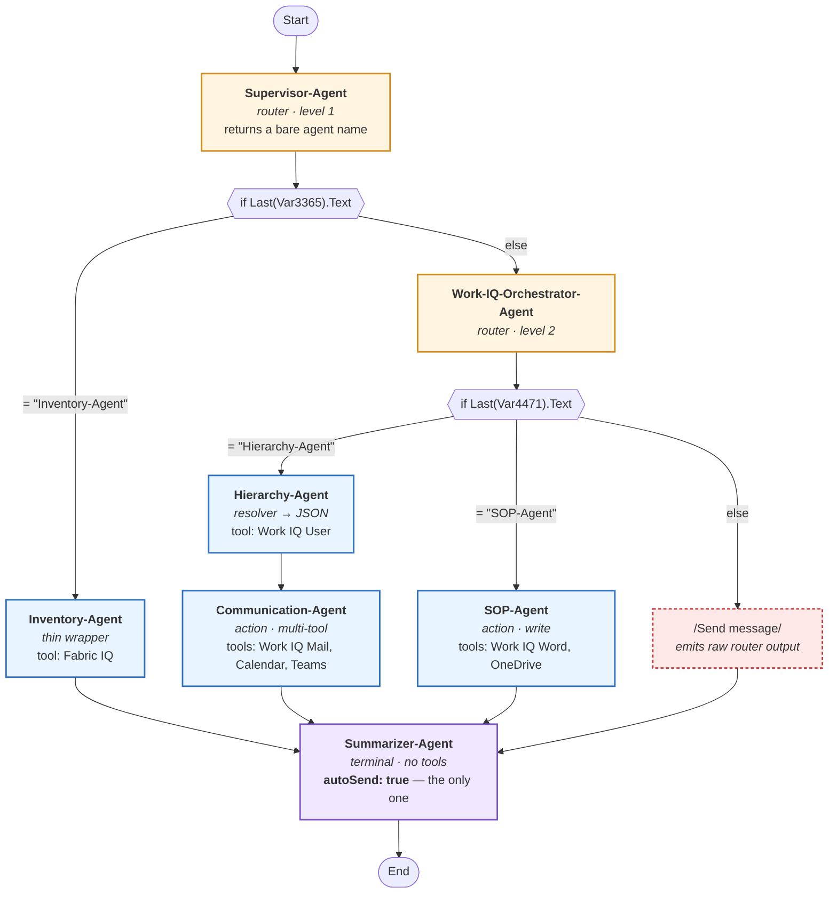

# Reference workflow — `Microsoft-IQ-Workflow`

**A complete, observed, seven-agent orchestration in Microsoft Foundry.**
Kept as a **reusable demo asset**: this is the diagram to put on screen when explaining what a
multi-agent system actually does, because every box maps to a real line of YAML.

> Observed in a Microsoft training lab, 2026-08-04. Foundry portal → Agents → **Workflows
> (Preview)** → Visualizer / YAML / Code.
>
> ⚠️ **Portal Workflows retire 2026-12-01.** The *architecture* below is portable and worth
> teaching. The *mechanism* is not — see [Longevity](#longevity) before building on it.

---

## The diagram



Node kinds in the portal's Visualizer: `Start` · `Supervisor-Agent` · `If / else condition` →
`If` / `Else If` / `Else` · agent nodes · `Send message` · `End`.

---

## Reading it in one minute — the demo script

Four beats, in this order. Each one is a single sentence and a single point on the diagram.

**1 — "The user never talks to an agent. They talk to the workflow."**
`Start` is the entry point (`trigger.kind: OnConversationStart`). The supervisor is just the
first node.

**2 — "The supervisor doesn't call anything. It classifies."**
It returns one word — a bare agent name — and stops. Point at the diamond below it: **the
workflow** does the calling, with an ordinary `if / else` on that string. Routing is a string
comparison, not magic.

**3 — "Routers nest, so no single prompt has to know everything."**
Level 1 splits data vs. productivity. Level 2 splits people vs. documents. Adding an eighth agent
does not lengthen the supervisor's prompt.

**4 — "Six agents run. One speaks."**
Every node is `autoSend: false` except the Summarizer. That one flag is why the user gets a
single coherent answer instead of six fragments — and it's why a no-tool summarizer earns its
place in the graph.

> If you have thirty seconds instead of five minutes, use beat 2 alone. *"The supervisor returns
> a word; the workflow does an if/else on it"* is the sentence that makes multi-agent
> orchestration stop sounding mystical.

---

## 🎬 Watching it run — the best moment of the demo

The workflow header has a **`Preview`** control (agents don't have one). It runs the graph live,
and this is where the demo earns its keep:

- **Nodes light up as they execute** — a green ✓ on completed nodes, a spinner on the one
  currently running. The control flow you just explained becomes visible, in real time, on the
  same picture.
- **A side pane prints each agent's actual output**, labelled by agent name, with a per-node
  **`Traces`** link.

Observed run — query: *"What are my priorities for today?"*

| Node | Status | Output shown in the pane |
|---|---|---|
| `Start` | ✓ | — |
| `Supervisor-Agent` | ✓ | **`Work-IQ-Orchestrator-Agent`** |
| `If / else condition` (L1) | ✓ | took the **`Else`** branch |
| `Work-IQ-Orchestrator-Agent` | ✓ | **`Hierarchy-Agent`** |
| `If / else condition` (L2) | ◯ running | evaluating `= "Hierarchy-Agent"` |
| `Hierarchy-Agent` | ◯ running | — |

### ✅ This verifies the mechanism — it is no longer inferred

Everything claimed above about routing is now *observed behaviour*, not a reading of the YAML:

1. **The routers really do emit a bare agent name.** `Supervisor-Agent` printed exactly
   `Work-IQ-Orchestrator-Agent` — no quotes, no sentence, no punctuation. The output-shape
   clause in the prompt works.
2. **The string equality really does dispatch.** L1 fell to `Else` (the reply wasn't
   `"Inventory-Agent"`), L2 matched `"Hierarchy-Agent"`. Exactly as written.
3. **The routing rules behave as documented.** *"What are my priorities for today?"* is listed
   in the Work-IQ router's prompt under *personal daily summary* → it went there, then to the
   resolver. Prompt intent → observed path, end to end.

### 🔑 `autoSend: false` hides output from the **user**, not from the **operator**

Every intermediate node is `autoSend: false`, yet the Preview pane displays each one's raw
output. The flag governs what reaches the conversation surface; the debug pane sees everything.

That distinction is what makes this demoable at all — you can show the routing decisions on
screen *and* still ship a product where the user only ever sees the Summarizer's answer.

> **Demo tip:** run it once in Preview with the pane open to explain the machinery, then run the
> published workflow app to show the clean single-voice experience. Same system, two audiences.

---

## Roles on the graph

Five distinct roles appear, and the shape of each prompt follows from its position:

| Node | Role | Tools | Output shape | Consumed by |
|---|---|---|---|---|
| Supervisor-Agent | Router L1 | none | one bare agent name | a **string equality** in YAML |
| Work-IQ-Orchestrator-Agent | Router L2 | none | one bare agent name | a **string equality** in YAML |
| Inventory-Agent | Thin wrapper | Fabric IQ | rigid `label : value` | the Summarizer |
| Hierarchy-Agent | Resolver | Work IQ User | **JSON** | Communication-Agent |
| Communication-Agent | Action, multi-tool | Work IQ Mail · Calendar · Teams | one-line confirmations / short prose | the Summarizer |
| SOP-Agent | Action, write | Work IQ Word · OneDrive | one-line confirmations | the Summarizer |
| Summarizer-Agent | Terminal | **none** | warm prose + one follow-up question | **the human** |

**The through-line: output shape follows the consumer.** A machine reads it → rigid format. A
human reads it → prose. This is the rule that makes the whole graph hold together, and it is
visible three separate times on one diagram.

Full pattern write-ups: [`orchestration_patterns.md`](orchestration_patterns.md) — Patterns A
(Router), B (Thin wrapper), C (Action), D (Synthesizer), E (Resolver).

---

## Tool distribution — least privilege, visible

```
Supervisor-Agent            →  (none)
Work-IQ-Orchestrator-Agent  →  (none)
Inventory-Agent             →  Fabric IQ
Hierarchy-Agent             →  Work IQ User
Communication-Agent         →  Work IQ Mail · Calendar · Teams
SOP-Agent                   →  Work IQ Word · OneDrive
Summarizer-Agent            →  (none)
```

Seven agents, zero overlap, and the two routers plus the summarizer hold **no tools at all**.
Work IQ being split per capability is what makes this expressible — an agent that only needs the
org chart cannot be talked into sending mail.

This is a strong slide on its own: *"the agent that decides has no power; the agents with power
don't decide."*

---

## The mechanism, honestly

Worth saying out loud in a demo, because someone always asks:

- Routing is **exact string equality** (`=Last(Local.Var3365).Text = "Inventory-Agent"`). That is
  why every router prompt ends with *"no quotes, no extra whitespace, no newline."*
- Continuity comes from a **shared `conversationId`**, not from any agent's memory.
- `Local.VarNNNN` variables capture each agent's output; several are captured and never read.
- Expressions are **Power Fx** (`=System.LastMessage`, `=Last(...)`).

### Known weaknesses in this exact graph

Don't demo these as features — but do know them, because they will show up if a run misbehaves.

| # | Weakness | Effect |
|---|---|---|
| 1 | Level 1 tests only `"Inventory-Agent"`; everything else falls to `else` | A malformed or empty supervisor reply routes to Work-IQ **silently** — the error path is indistinguishable from a valid decision |
| 2 | The level-2 `else` is `Send message: Local.Var4471` | Emits the router's **raw output** (a bare agent name) to the user as if it were the answer |
| 3 | `Local.Var7934` / `Var8202` / `Var9934` are written, never read | Inert variables; the wiring looks richer than it is |
| 4 | Agent names are string literals in the agent object, the router prompts **and** the YAML | Renaming one agent breaks two other places, silently |

**❓ Open question — is the hierarchy JSON actually delivered?**
`Hierarchy-Agent` writes to `Local.Var9934`, then `Communication-Agent` is invoked with
`input.messages: =System.LastMessage` — not that variable. Whether the JSON reaches it depends on
whether `autoSend: false` still writes to the shared conversation. Both readings fit the
evidence. **Resolve by running it once and reading the `Traces` tab.**

---

## Longevity

| | |
|---|---|
| **Keep** | The architecture — router → condition dispatch → typed handoffs → single-voice terminal agent. Portable to any orchestration runtime. |
| **Don't inherit** | Portal Workflows YAML. **Retires 2026-12-01.** |
| **Forward path** | **Microsoft Agent Framework** for orchestration, **A2A tool** for agent-to-agent calls. |

The rebuild is mechanical: this YAML maps almost line-for-line onto a `switch` over the router's
output — and a code-first dispatcher can *validate* that output instead of falling through
silently, which fixes weaknesses 1 and 2 for free.

For a demo running before 2026-12-01, the portal version is the better teaching tool: the
Visualizer makes the control flow self-evident in a way code does not.

---

## Reproducing the diagram

- **In a deck or doc:** paste the Mermaid block above.
- **As a styled HTML diagram with Azure/Fabric icons:** hand it to
  `Meta-Brain/agents/architecture-design-agent/`.
- **From the portal:** Agents → Workflows → open the workflow → `Visualizer`.
  The three views — `Visualizer` · `YAML` · `Code` — are the same object; the Visualizer is the
  one to screen-share.

Workflow surface observed: tabs `Build · Traces · Monitor · Evaluation`; toolbar `New node ·
Add note · Hide notes`; header `Version: N` with **`Save` · `Preview` · `Publish`** — a
`Preview` control that agents do not have, letting you exercise the graph before publishing the
workflow app.

---

## Source YAML

Complete YAML with per-line commentary:
[`orchestration_patterns.md` → *the dispatcher is a Workflow*](orchestration_patterns.md).
