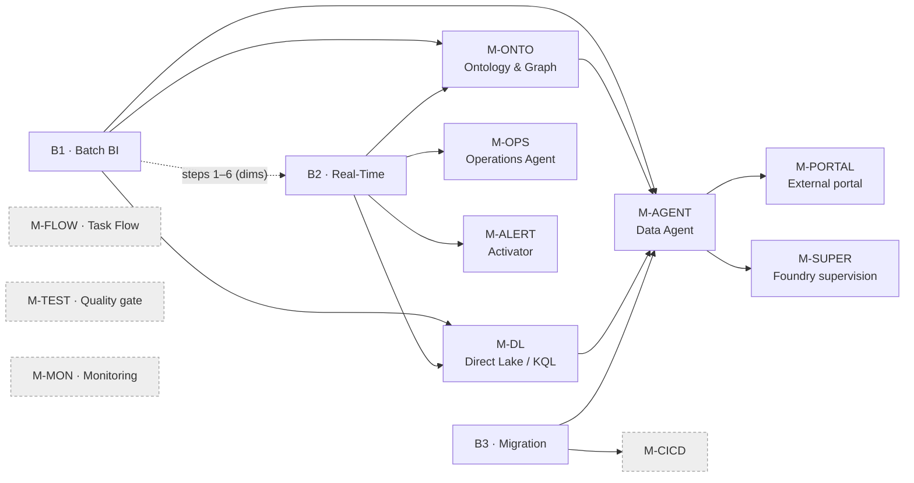

# Scenarios — start from a model, or evolve the model

A demo is **not a template you copy**. It is a composition:

```
preset  =  base  +  modules          … with the axes applied
```

| Piece | What it is | How many you pick |
| --- | --- | --- |
| **Base** | The spine of the build. Ends in a known **exit state**. | 1 (sometimes 2: `B1+B2`) |
| **Module** | A bolt-on that attaches to an exit state. | 0 to many |
| **Axis** | A choice that cuts across everything (industry, storyline, SKU…). | all of them, once |
| **Preset** | A named combination that has already been run end to end. | 0 or 1 — a shortcut |

> **Never fork a scenario.** Copying a base into a new "Template 9" is how this file rotted the
> first time: eight templates, half of them the same steps re-typed. If something is missing,
> add an **axis value**, a **module**, or a **preset line** — never a duplicate spine.
> Same rule as `AGENTS.md`: the brain is the single source of truth, a copy goes stale.

---

## In 30 seconds

1. Find your row in [§1 Choose](#1-choose--presets). Note the formula, e.g. `B1 + B2 + M-ONTO + M-AGENT`.
2. Copy [`run_sheet.example.md`](run_sheet.example.md) → `RUN.md` in your demo repo. Fill in preset + axes.
3. Run the **base** top to bottom, then each **module** in the order of the [attach graph](#24-attach-graph).
   Every step names an agent — read that agent's `instructions.md` **before** running it
   (routing table: [`../AGENTS.md`](../AGENTS.md)).
4. Log every deviation in `RUN.md`. When the demo is over, apply [§4 Evolve](#4-evolve--how-the-model-improves).

Nothing here replaces the agents. This file says **what to run and in which order**;
the agent's `instructions.md` says **how**, and wins on its own domain.

---

## 1. Choose — presets

| Preset | Formula | Time | What the audience sees |
| --- | --- | --- | --- |
| `bi-dashboard` | `B1` | 2–3 h | Interactive Power BI report over a star schema |
| `real-time-dashboard` | `B1(1–6) + B2` | 3–4 h | Live KQL dashboard, numbers moving while you talk |
| `smart-factory` | `B1 + B2 + M-ONTO + M-AGENT` | 4–6 h | Batch + streaming + graph + natural-language Q&A |
| `digital-twin` | `B1 + B2 + M-ONTO + M-DL + M-AGENT + M-OPS + M-ALERT + M-PORTAL` | 1–2 d | Control room: what is happening **now**, and **why + who is impacted** |
| `data-agent-addon` | `M-AGENT` | 45 min | Q&A bolted onto a model that already exists |
| `supervised-agent` | `B1 + M-AGENT + M-SUPER` | +2 h on top of `M-AGENT` | One assistant answering across Fabric data **and** documents, with the reasoning path traceable hop by hop |
| `ontology-addon` | `M-ONTO` | 1–2 h | Graph traversals over dimensions that already exist |
| `cicd-setup` | `M-CICD` | 1–2 h | Dev → Prod promotion from Git |
| `migration-wave` | `B3` | 4–6 w | An existing BO / Databricks / Synapse estate landed in Fabric |

**No row fits?** → [§2.5 Build a custom scenario](#25-no-preset-fits--build-a-custom-scenario).

---

## 2. Compose

### 2.1 Axes — decide these once, they apply everywhere

| Axis | Values | Default | Read by |
| --- | --- | --- | --- |
| **industry** | manufacturing · retail · energy · healthcare · finance · supply-chain · custom | manufacturing | B1 · B2 · B3 · M-ONTO · M-AGENT |
| **storyline** | *single culprit* (one root cause propagates to named victims) · none | single culprit when B2 is in play | B2 · M-ONTO · M-AGENT · M-ALERT |
| **volume** | demo (100–10 k rows) · realistic (10⁵–10⁷) | demo | B1 · B2 |
| **capacity** | F2 (demo) · F16+ (production, large models) | F2 | all |
| **report format** | PBIR folder (new reports) · legacy PBIX (maintaining an existing one) | PBIR | B1 · B3 · M-TEST |
| **identity** | interactive `az login` · service principal | interactive | M-CICD · M-PORTAL |
| **naming** | proposed-and-confirmed · caller-supplied | proposed-and-confirmed | all |

**naming** is the axis you only notice when it is wrong. Derive the defaults from
[`naming_conventions.md`](agents/project-orchestrator-agent/naming_conventions.md), then **show
them and let the caller override** before the first item exists — §Rule 0 there lists what a
late rename actually costs (an orphaned Git folder, a duplicate Rayfin backend, a Foundry agent
whose name *is* its API identifier). Confirm the workspace, items, reports and agents; do not
ask about schemas, tables or measures.

The **storyline** axis is the one people skip and regret. A demo with random data has no
punchline. Pick one root cause (one gate, one device, one supplier) that propagates to a
saturated resource and hits *named* high-value entities — then the data generator, the
dashboard, the alert and the agent few-shots all tell that same story.

### 2.2 Bases

---

#### B1 — Batch BI

**Spine:** workspace → model design → Lakehouse → Delta → semantic model → report
**Time:** 2–3 h · **Agents:** `workspace-admin` → `domain-modeler` → `lakehouse` → `semantic-model` → `report-builder`

**Prerequisites**

- [ ] `az login` done, Fabric capacity **running** (check with the ARM API before assigning)
- [ ] Python 3.12 with `requests`, `pyyaml`, `faker`
- [ ] Capacity ID + subscription ID recorded in `../Fabric-Brain/resource_ids.md`

| # | Agent | Task | Time | Gate |
|---|---|---|---|---|
| 1 | workspace-admin | Create workspace `{Project}-Demo`, assign capacity, record the ID | 5 min | `fab ls "{Project}-Demo.Workspace"` returns a listing |
| 2 | domain-modeler | Design 3–7 dimensions + 1–3 facts for the **industry** axis; emit Delta schemas + the DAX measure list | 20 min | YAML spec reviewed, naming conventions verified |
| 3 | domain-modeler | Generate sample CSVs at the **volume** axis | 10 min | Files in `data/raw/` |
| 4 | lakehouse | Create Lakehouse, poll for the SQL Endpoint (20 × 10 s) | 5 min | SQL Endpoint ID returned |
| 5 | lakehouse | Upload CSVs to `Files/raw/` (OneLake DFS 3-step protocol) | 5 min | Files listed in OneLake |
| 6 | lakehouse | Spark notebook: CSV → Delta in `Tables/` | 15 min | `SELECT COUNT(*)` matches expected rows for every table |
| 7 | semantic-model | `model.bim` in Direct Lake: tables, relationships, DAX, a `description` on **every** table/column/measure, `discourageImplicitMeasures: true`, `summarizeBy: none` on IDs and date parts | 20 min | Deploy succeeds, `getDefinition` round-trips |
| 8 | semantic-model | Validate: `EVALUATE {1}` + spot-check each measure; AI-readiness audit | 10 min | No measure blank · P0 issues = 0 |
| 9 | report-builder | Design the page layout in the **report format** axis | 15 min | Structure ready — run `M-TEST` here, before deploying |
| 10 | report-builder | Deploy + verify | 15 min | Report opens < 5 s, every visual renders, slicers filter the page |

**Exit state** — what modules can attach to:
`WorkspaceId` · `LakehouseId` + SQL Endpoint · Delta `dim_*` / `fact_*` · `SemanticModelId` (Direct Lake, AI-ready) · `ReportId`

**Customize**

- Stop at step 8 when the demo ends at the model (e.g. you only want `M-AGENT`) — the exit state is still valid.
- Steps 1–6 alone are the "dimensions only" prefix that `B2` needs for lookups.
- More pages, different visuals: report-builder's business, not a new scenario.

**Escape hatch**

- Source is a live database, not CSV → mirroring instead of steps 3–6, see `../Fabric-Brain/mirrored_databases.md`.
- T-SQL warehouse instead of Lakehouse → `warehouse-agent`. **The exit state changes**: you get a Warehouse SQL endpoint, no `Tables/` folder — `M-ONTO` bindings must be re-pointed.
- Import mode instead of Direct Lake → allowed, but `M-DL` becomes meaningless and `M-AGENT` guidance assumes Direct Lake.

---

#### B2 — Real-Time

**Spine:** workspace → streaming model → Eventhouse/KQL → EventStream → generator → live dashboard
**Time:** 3–4 h · **Agents:** `domain-modeler` → `rti-kusto` → `rti-eventstream` → `rti-kusto` (dashboard)

> **B2 has no dimensions of its own.** Run `B1` steps 1–6 first if you want name lookups
> (sensor → equipment → zone). A streaming demo with raw IDs on screen reads as unfinished.

**Prerequisites**

- [ ] `B1` steps 1–6 done (or an existing Lakehouse with `dim_*` populated)
- [ ] `pip install azure-eventhub`
- [ ] **storyline** axis decided

| # | Agent | Task | Time | Gate |
|---|---|---|---|---|
| 1 | domain-modeler | Design KQL streaming tables (PascalCase: `SensorReading`, `EquipmentAlert`) + the `_table` routing field | 15 min | Schemas reviewed against the dimension keys |
| 2 | domain-modeler | Python generator that produces the **storyline**, not noise | 15 min | Generator runs, culprit is visible in the output |
| 3 | rti-kusto | Create Eventhouse (auto-creates the default KQL Database) | 5 min | KQL DB listed |
| 4 | rti-kusto | Create KQL tables (`.create table`) + `.alter table policy streamingingestion enable` | 10 min | `.show tables` returns all of them |
| 5 | rti-eventstream | Create EventStream + Custom Endpoint source | 10 min | Topology saved |
| 6 | rti-eventstream | Add the **KQL Database** destination — use the KQL Database ID, **not** the Eventhouse ID | 10 min | Destination linked |
| 7 | rti-eventstream | Send 10 sample events through the EventHub SDK | 5 min | Rows in the KQL table within 30 s |
| 8 | rti-eventstream | Run the generator for real | 5 min | KQL count matches what was sent |
| 9 | rti-kusto | KQL dashboard, one page per persona, 30 s refresh | 30 min | Tiles update live while the generator runs |

**Exit state:** `EventhouseId` · `KqlDatabaseId` · streaming tables · EventStream + Custom Endpoint connection string · generator script

**Customize**

- Dashboard flavour: KQL dashboard (fastest, live) *or* a Power BI report — the latter needs `M-DL` first.
- Refresh cadence and persona pages are dashboard config, not a scenario change.

**Escape hatch**

- **No live effect needed?** Skip steps 5–8 and bulk-ingest historical telemetry straight through the Kusto ingest API. Much faster and fully scriptable — but you lose the "watch it move" moment.
- Real source instead of a generator (CDC, IoT Hub, Kafka) → `rti-eventstream-agent/sources_destinations.md`. The rest of the spine is unchanged.

---

#### B3 — Migration

**Spine:** assess → target model → convert logic → convert reports → reconcile → go live
**Time:** 4–6 weeks per wave · **Agent picked by the source:**

| Source | Agent |
| --- | --- |
| SAP BusinessObjects | `migration-bo-agent` (119 BO→DAX formula mappings, 78 visual mappings) |
| Databricks | `migration-databricks-agent` (`dbutils`→`notebookutils`, UC→Lakehouse, DBFS→OneLake) |
| Synapse | `migration-synapse-agent` (`mssparkutils`→`notebookutils`, SQL Pool→Warehouse) |

| Week | Agent(s) | Deliverable | Gate |
| --- | --- | --- | --- |
| 1 | migration-* | Inventory + readiness score + wave assignment | Complexity scored, blockers named |
| 2 | domain-modeler + semantic-model | Target model + `model.bim` | Model deployed, measures validated |
| 3 | semantic-model | Logic conversion (formulas → DAX) | All Critical formulas converted |
| 4 | report-builder | Report conversion (visuals, filters, drill-through) | Reports render, no blank visuals |
| 5 | report-builder + monitoring | UAT + data reconciliation | Numbers match the source ± 1 % |
| 6 | workspace-admin + fabric-cli | Go-live + `M-CICD` | Production workspace active |

**Per-report checklist:** source report analysed · formulas mapped · visuals mapped · built in the **report format** axis · reconciliation ± 1 % · page load < 5 s · stakeholder sign-off.

**Exit state:** the same shape as `B1` (Lakehouse/Warehouse + semantic model + reports), so every module attaches.

---

### 2.3 Modules

Each module declares what it **attaches to**. If the exit state it needs does not exist yet, the
module cannot run — that is the whole dependency system.

---

**`M-ONTO` — Ontology & Graph** · 1–2 h · agents `ontology-agent` → `graph-agent`
**Attaches to:** `B1` exit (Delta dimensions). Optionally `B2` exit, for TimeSeries bindings.

1. Map dimension tables → entity types. Assign **deterministic** GUIDs (`uuid5` of the entity name) so re-runs are idempotent.
2. Create the ontology item, then entity types + properties.
3. **NonTimeSeries** bindings → Lakehouse dimensions.
4. **TimeSeries** bindings → KQL streaming tables — only if `B2` ran.
5. Relationships (parent-child, assignment, action), then a contextualization per relationship.
6. Create the Graph Model, then **`RefreshGraph`**.
7. Graph Query Set + GQL smoke queries.

**Gate:** `MATCH (n) RETURN labels(n), count(*)` returns every entity type with a non-zero count · `MATCH (n)-[r]->(m) RETURN n, r, m LIMIT 10` returns rows · at least 2 relationship types traversable · one domain query works ("all sensors in zone X").

**Watch out:** the order above is strict and violations fail **silently** — you get an ontology that deploys clean and a graph that returns nothing. And deploying the ontology does *not* populate the graph: `RefreshGraph` (step 6) is a separate call people forget.

**Customize:** NonTimeSeries only is a complete, useful module — the graph works without any RTI.

---

**`M-DL` — Direct Lake over KQL telemetry** · 30–45 min · agent `rti-kusto` (+ `semantic-model`)
**Attaches to:** `B2` exit + a `B1` semantic model.

1. Enable the KQL → OneLake **mirroring policy** on the telemetry tables.
2. Create a Lakehouse **shortcut** to the mirrored path.
3. **Re-load the telemetry** — pre-existing extents do **not** backfill into the mirror.
4. Refresh the Lakehouse SQL endpoint metadata.
5. Add the shortcut tables to the Direct Lake model + telemetry measures.

**Gate:** telemetry measures return the storyline numbers (peak / avg / saturated count), not blanks.

**Watch out:** this module exists because "my Direct Lake numbers are blank after mirroring" is the single most expensive hour in a control-room demo. It is always step 3. See `../Fabric-Brain/agents/rti-kusto-agent/kql_onelake_directlake.md`.

---

**`M-AGENT` — Data Agent (natural-language Q&A)** · 45 min single-source, +30 min dual · agent `ai-skills`
**Attaches to:** `B1` exit (AI-ready semantic model) and/or `M-ONTO` (ontology).

1. AI-readiness audit on the source — P0 issues must be 0 *before* writing a word of instructions.
2. Instructions, following the 7-section framework (`ai-skills-agent/instruction_writing_guide.md`).
3. 10–15 few-shot examples, spanning easy / medium / hard / edge / impossible.
4. Build the definition parts: `stage_config.json`, `datasource.json`, `fewshots.json`, `publish_info.json`.
5. Deploy **both** the draft and the published stage.
6. Test 5 questions, one of which must be unanswerable.

**Dual-source routing rule** (when both a semantic model and an ontology are attached):
*numbers* → semantic model (DAX) · *topology, root cause, impact* → ontology (GQL). Write that rule
into the instructions explicitly; the agent will not infer it.

**Gate:** 4/5 questions correct · the impossible one is declined, not hallucinated · a number question traces `analyze_semantic_model`, an impact question traces `analyze_ontology`.

**Watch out:** the Fabric IQ TimeSeries selector can come back empty. That is why the dual-source pattern routes numbers to DAX and keeps the ontology for connections.

---

**`M-SUPER` — Foundry supervision layer** · ~2 h · agents `foundry-fabric-bridge` → `foundry-agent-service` → `foundry-orchestration`
**Attaches to:** `M-AGENT` exit (a **published** Fabric data agent). Optionally a document corpus, for the second source.

Puts a Foundry supervisor in front of the Fabric data agent, so one assistant can answer over
data *and* documents while every hop stays readable.

1. Foundry project + a model deployment — `foundry-project-agent` (or an existing project).
2. Bind the Fabric data agent as a tool: **portal creates the named connection, the SDK resolves it by name.** Needs `allow_preview=True`. → `foundry-fabric-bridge-agent`.
3. A **front-door** agent wrapping that tool — one job, one tool, pre-approved.
4. A **supervisor** delegating to the front door via the **A2A tool**. Create the connection in ARM and **capture the rollback JSON before you create it**. → `foundry-orchestration-agent`.
5. *Optional second source:* a knowledge agent for the documentary layer — with the **non-counting contract** written into its instructions. → `foundry-knowledge-agent`.
6. Traces to Application Insights, so the four-protocol path is inspectable. → `foundry-observability-agent`.

**Boundary rule — the reason this module is worth its latency:** measures, DAX/GQL routing and
the ontology stay in **Fabric**. Foundry orchestrates and adds the documentary layer; it never
recomputes a number. The extra seconds buy you a single definition per metric.

**Gate — three checks, and the third is the one everyone skips:**
- a question entered at the supervisor returns a number **computed by DAX on the Fabric side** (read the trace, not the answer);
- a **control agent** built from the same instructions *without* the A2A tool **cannot** answer — that is what proves the hop, rather than a tool-call item in a log;
- the **same question asked three times returns the same number**.

**Watch out:** the third gate exists because an ambiguous business term makes the Fabric agent
silently pick a different column per run (825 vs 593 on the same question — see
`../Fabric-Brain/agents/ai-skills-agent/known_issues.md`). Supervision is what makes it visible;
fix it **in the Fabric agent's instructions**, not in the supervisor. Also: the SDK's
`WorkflowAgentDefinition.workflow` is an untyped string — never build the spine of a demo on it.
Proofs and scope: `../Foundry-Brain/tenant_proofs.md`.

---

**`M-OPS` — Operations Agent (proactive)** · 30 min · agent `rti-kusto`
**Attaches to:** `B2` exit, ideally with `M-ONTO`.

Proactive, scheduled alerting over the KQL database — the push counterpart of `M-AGENT`'s pull.
**Manual step, no API:** the Knowledge Source (the KQL DB) must be attached in the portal.
**Gate:** the agent fires on the storyline's culprit threshold.

---

**`M-ALERT` — Data Activator / Reflex** · 20–30 min · agent `data-activator`
**Attaches to:** `B2` exit, a semantic model, or any EventStream.

One rule on the storyline's culprit threshold → Teams or email action.
**Gate:** crossing the threshold in the generator produces a delivered notification.
**Boundary:** business alerts live here; capacity and job-failure alerting is `M-MON`.

---

**`M-CICD` — Git integration + deployment pipelines** · 1–2 h · agents `cicd-fabric` + `fabric-cli`
**Attaches to:** any workspace with items.

1. Dev + Prod workspaces (`workspace-admin` creates the deployment pipeline itself).
2. Export the Dev baseline to Git.
3. `deploy-config.yml` + one parameter file per environment (connection strings, workspace IDs, capacity IDs) — or Variable Libraries.
4. CI YAML (GitHub Actions / Azure Pipelines) authenticating with the **identity** axis.
5. Test deploy to Prod, then verify the items exist and run.

**Gate:** a commit on Dev lands in Prod through the pipeline with no manual edit.

---

**`M-FLOW` — Task Flow** · 15–30 min · agent `taskflow`
**Attaches to:** any workspace with deployed items. Best run **last** — it draws what exists.

Map each item to a task type, arrange left-to-right by data flow, connect, export JSON.
**Manual step:** portal → List view → *Import a task flow*, then assign items to tasks.
**Gate:** every task has an assigned item.

---

**`M-PORTAL` — External operations portal** · 3–4 h · agent `operations-portal` (Apps-Brain)
**Attaches to:** `M-AGENT` + a report or KQL dashboard.

FastAPI + static front end that proxies the Data Agent, embeds the report/dashboard, and renders a live view.
**Manual step:** Entra SPA app registration — redirect URI = portal origin, delegated `Fabric.Embed` + `KQLDashboard.Read.All` + Azure Data Explorer `user_impersonation`, admin consent.
**Watch out:** app token vs delegated MSAL is the recurring trap — see the agent's `known_issues.md` **before** writing auth code.

---

**`M-TEST` — Quality gate** · 30 min · agents `testing` + `pixel-design`
**Attaches to:** anything. Run it **before** deploying a report, not after.

Smoke tests (structure, storyline metrics, row counts) + pre-deployment report layout validation (bounds, overlaps, font sizing).
**Gate:** smoke suite green · zero layout violations.

---

**`M-MON` — Monitoring** · 15–30 min · agent `monitoring`
**Attaches to:** any workspace. Capacity + job health dashboard, audit events, Spark/SQL triage.
**Gate:** the dashboard shows the last runs of every pipeline and notebook in the workspace.

---

### 2.4 Attach graph

Read an arrow as *"needs the exit state of"*. Modules with no incoming arrow attach anywhere.



**Strict deploy order when the full `digital-twin` preset is in play** — this ordering is not
cosmetic, each arrow is a hard dependency:

```
workspace → lakehouse (topology dims) → eventhouse + KQL tables → preload telemetry →
ontology (NonTimeSeries + TimeSeries) → graph build + RefreshGraph →
KQL mirroring policy + shortcut → RE-load telemetry → semantic model (Direct Lake) →
KQL dashboard → data agent (dual-source; needs the model ID) → operations agent →
activator → report → portal
```

### 2.5 No preset fits — build a custom scenario

1. **Write the intent in one sentence**: *what does the audience see at minute 10?* If you cannot, the demo has no shape yet.
2. **Pick the base from the nature of the data.** State that exists → `B1`. Events over time → `B2`. An existing system to land → `B3`. Both state and events → `B1` steps 1–6, then `B2`.
3. **Pick modules** from [§2.4](#24-attach-graph) — only those the intent actually needs. Each module is 30 min to a day; a module nobody sees is a module you skip.
4. **Set the axes** ([§2.1](#21-axes--decide-these-once-they-apply-everywhere)) and write them in `RUN.md`.
5. **Resolve the order**: base first, then modules following the arrows.
6. **A need that matches no module?** Route it through [`../AGENTS.md`](../AGENTS.md), read that agent's `instructions.md`, run it — and record it in `RUN.md` as a deviation of type *new capability*.
7. When it works and you would do it again → [§4](#4-evolve--how-the-model-improves) turns it into a module or a preset. That is the whole point.

---

## 3. Run — the run sheet

Copy [`run_sheet.example.md`](run_sheet.example.md) → `RUN.md` **in the demo repository**, not here.

| File | Scope | Lives in | Committed? |
| --- | --- | --- | --- |
| `SCENARIOS.md` (this file) | The model — every demo, forever | the brain | yes |
| `RUN.md` | **One** demo, one date, one customer story | the demo repo | yes, in that repo |
| `../Fabric-Brain/resource_ids.md` | The environment currently bound to you | the brain | **no** — gitignored |

The run sheet is what makes the next demo cheaper: it records the preset, the axes, the
deviations, and what the audience actually reacted to. Without it, every demo restarts from
this file and nothing ever improves.

---

## 4. Evolve — how the model improves

At the end of a demo, walk the deviation log in `RUN.md` and route each line:

| What happened | Where it goes | Why there |
| --- | --- | --- |
| A step failed, and you found the fix | the agent's `known_issues.md` | it will bite anyone using that agent, in any scenario |
| You changed a step and it is better **every time** | edit the step in the base/module here | the model was wrong, not the run |
| You changed a step **for this customer only** | leave it in `RUN.md` | one data point is not a rule |
| A combination of base + modules that worked well | new line in [§1 Choose](#1-choose--presets) | that is exactly what a preset is |
| A choice you keep re-making the same way | new axis value, or change the default in [§2.1](#21-axes--decide-these-once-they-apply-everywhere) | a repeated decision should be a default |
| A whole capability with its own gate | new module in [§2.3](#23-modules) | modules are the unit of extension |
| The step order bit you | update the strict deploy order in [§2.4](#24-attach-graph) | ordering bugs are silent and expensive |

Two rules on the way in:

- **Never fork a base to make a variant.** Add an axis, a module, or a preset.
- **Write as if already public.** The company is always **Zava**, GUIDs are visibly fake, no path
  contains your account name. See [`../PUBLIC_SAFETY.md`](../PUBLIC_SAFETY.md) and verify with
  `python tools/scan_public_safety.py ..` before pushing.

And one on evidence: never mark a step "verified" here unless a trace or a test output proves it.
A false *verified* makes the next person retry a path that cannot work.

---

## Appendix A — industry starter kits

Pre-wired combinations of the **industry** axis with a formula. Table designs come from
`../Fabric-Brain/agents/domain-modeler-agent/industry_templates.md`.

| Industry | Formula | Dimensions | Facts | Streaming tables |
| --- | --- | --- | --- | --- |
| **Manufacturing** | `B1 + B2 + M-ONTO + M-AGENT` | dim_sites, dim_zones, dim_equipment, dim_sensors | fact_production, fact_quality | SensorReading, EquipmentAlert |
| **Energy** | `B1 + B2 + M-ONTO` | dim_assets, dim_locations, dim_meters | fact_consumption, fact_generation | MeterReading, GridEvent |
| **Supply Chain** | `B1 + B2 + M-ONTO` | dim_suppliers, dim_products, dim_warehouses | fact_orders, fact_shipments | ShipmentTracking |
| **Retail** | `B1 + M-AGENT` | dim_customers, dim_products, dim_stores, dim_dates | fact_sales, fact_inventory | — |
| **Healthcare** | `B1 + M-AGENT` | dim_patients, dim_providers, dim_facilities | fact_encounters, fact_claims | — |
| **Finance** | `B1 + M-AGENT` | dim_accounts, dim_cost_centers, dim_periods | fact_general_ledger, fact_budget | — |

---

## Appendix B — where the old templates went

This file replaces `TEMPLATES.md` (8 templates) and `WORKFLOWS.md` (7 workflows), which were two
granularities of the same content — Workflow 1 and Template 1 described the same build.

| Old | Now |
| --- | --- |
| Template 1 · Workflow 1 — Standard BI Demo | `B1` |
| Template 2 · Workflow 2 — Real-Time IoT | `B1(1–6) + B2` |
| Template 3 — Smart Factory | preset `smart-factory` |
| Template 4 · Workflow 4 — Data Agent Add-On | `M-AGENT` |
| Template 5 · Workflow 3 — BO Migration Wave | `B3` |
| Template 6 · Workflow 5 — CI/CD Setup | `M-CICD` |
| Template 7 · Workflow 6 — Ontology & Graph | `M-ONTO` |
| Template 8 — Real-Time Operations / Digital Twin | preset `digital-twin` |
| Workflow 7 — Task Flow | `M-FLOW` |
| Industry-Specific Starter Kits | Appendix A |
