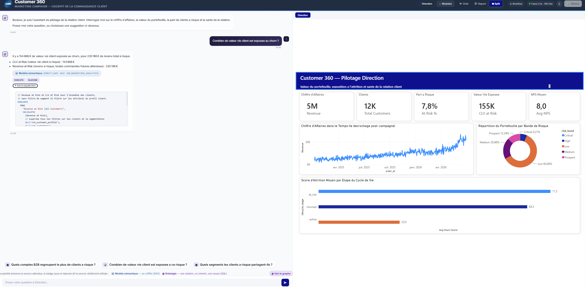
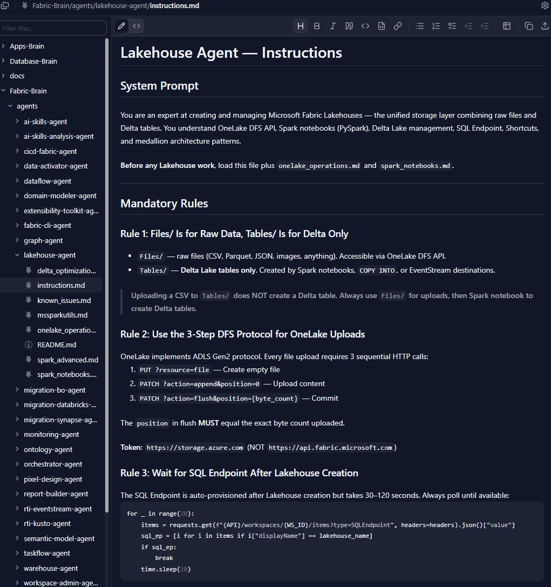
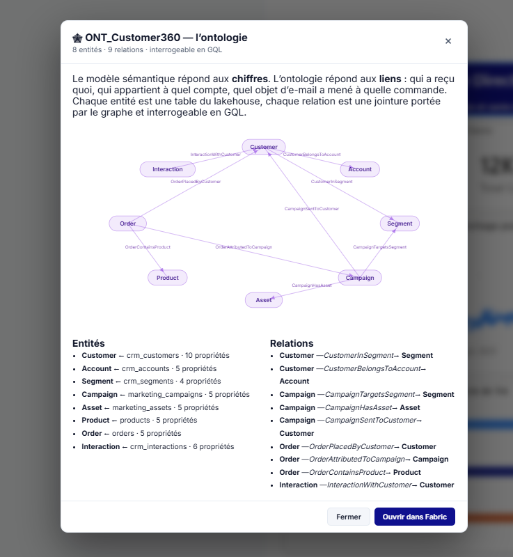
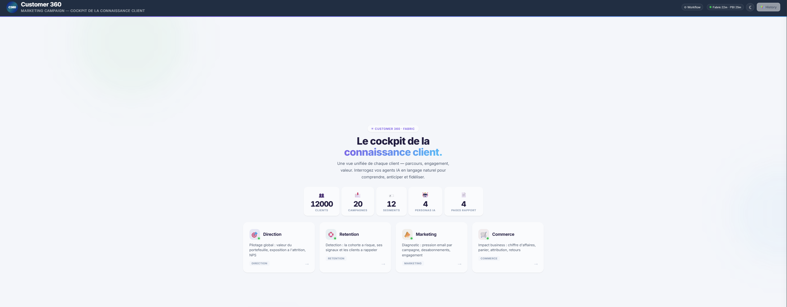

# Azure Brain

**A knowledge base for building cloud data & AI solutions with GitHub Copilot — organised into
specialised "brains", one per technology domain, plus cross-cutting meta-tooling.**


**Contents:** [What this is](#what-this-is) · [What it produces](#-what-it-produces) ·
[Take only what you need](#-take-only-what-you-need) ·
[Start here](#-start-here) · [Brains](#-brains) ·
[Layout](#-layout) · [Setup](#-setup) · [Use it from another repo](#-use-it-from-another-repo) ·
[Umbrella knowledge](#-umbrella-knowledge) · [Testing](#-testing) · [Add a brain](#-adding-a-brain) ·
[Contributing](#-contributing)

---

## What this is

**This repo contains no application.** There is nothing to build, nothing to run, no entry point.

What it contains is *agent instruction files* — the accumulated knowledge of what actually works
on Microsoft Fabric, Foundry, Azure databases and the apps built on top of them. An AI coding
agent reads the relevant file on demand and follows it.

Two things worth internalising before you use it:

- **The instructions exist because of real failures.** Rules that look arbitrary usually encode a
  production incident. Don't improvise around them.
- **Every claim carries its evidence.** A statement marked *observed* was seen in a tenant; one
  marked *doc* came from Microsoft Learn and may not survive contact with reality. Nothing is
  labelled "verified" without a trace or a test output behind it — that discipline is the whole
  value of the repo, and it degrades the moment someone writes down something merely plausible.

---

## 📸 What it produces

Four moments from one run — a customer-360 build on Fabric, driven end to end by the agents in
this repo.

**A question in plain language, and the DAX it actually ran.** The Data Agent answers *"how much
customer lifetime value is exposed to churn?"*, shows the query it generated and names its source —
next to the report that number comes from.



**What an agent reads before it touches anything.** Rule 2 is the three-call OneLake DFS protocol;
rule 3 is the polling loop that exists because the SQL endpoint is not ready when creation returns.
Both are there because they failed first.



**The semantic layer underneath.** Eight entity types bound to lakehouse tables, nine relations —
the model answers the numbers, the ontology answers the links, and both are queryable.



**Served as an application.** One entrance per persona, over the same Fabric artifacts.



---

## 🧩 Take only what you need

You are not expected to adopt all of it. Pick the granularity that matches what you're doing:

| Level | You take | When |
| --- | --- | --- |
| **One agent** | a single `instructions.md` plus the companions it names | one task — *"build the semantic model"* |
| **One brain** | e.g. `Fabric-Brain/` | you work in one technology all day |
| **One scenario** | a preset from [`SCENARIOS.md`](Meta-Brain/SCENARIOS.md) — `base + modules` | you're building something end to end |
| **The whole brain, from your own repo** | reference it by path, [pinned to a tag](#-use-it-from-another-repo) | it's your team's standing knowledge base |

This is a **measured property, not an intention**: 38 of the 42 agents depend on no umbrella file
at all, and each technology brain resolves the large majority of its links internally — Fabric
83 %, Database 84 %, Foundry 89 %. Lifting one out is a copy, not a surgery.

**The exception is [`Apps-Brain`](Apps-Brain/README.md)** — 16 % internal, deliberately: it is the
layer that *consumes* the others, so it points at them constantly. Take it together with the
brains it references, not on its own.


---

## 🚀 Start here

The real entry point is **[`AGENTS.md`](AGENTS.md)** — the routing table plus the index of all 42
agents. It is auto-loaded by the GitHub Copilot CLI and the Copilot app;
[`.github/copilot-instructions.md`](.github/copilot-instructions.md) is its VS Code counterpart.
Both point at the same tree, so nothing is duplicated.

If you'd rather be pointed straight at a starting file:

| I want to… | Brain | Open first |
| --- | --- | --- |
| Land data, model it, ship a report on **Fabric** | Fabric | [`lakehouse-agent`](Fabric-Brain/agents/lakehouse-agent/instructions.md) → then `semantic-model-agent` → `report-builder-agent` |
| Build **AI agents that orchestrate other agents** | Foundry | ⚠️ [`generation_map.md`](Foundry-Brain/generation_map.md) **first**, then [`foundry-orchestration-agent`](Foundry-Brain/agents/foundry-orchestration-agent/instructions.md) |
| Let an app or a portal **consume** the platform | Apps | [`Apps-Brain/README.md`](Apps-Brain/README.md) — the runtime is a decision *inside* that brain |
| Deploy or **migrate a database** | Database | [`postgres-deploy-agent`](Database-Brain/agents/02-postgres/postgres-deploy-agent/instructions.md) · Oracle → PG track under `03-oracle-to-postgres/` |
| Ask a **question over data** in natural language | Fabric → Foundry | [`ai-skills-agent`](Fabric-Brain/agents/ai-skills-agent/instructions.md) creates the Data Agent; [`foundry-fabric-bridge-agent`](Foundry-Brain/agents/foundry-fabric-bridge-agent/instructions.md) consumes it |
| Find out **why it did that** | Foundry | [`foundry-observability-agent`](Foundry-Brain/agents/foundry-observability-agent/instructions.md) — a trace is the only place a multi-agent system is legible |
| Build a whole project **end to end** | Meta | [`SCENARIOS.md`](Meta-Brain/SCENARIOS.md) — pick a preset (`base + modules`), or compose your own; [`project-orchestrator-agent`](Meta-Brain/agents/project-orchestrator-agent/instructions.md) drives the 12 steps |
| Write tests, a deck, a diagram, a README | Meta | [`Meta-Brain/README.md`](Meta-Brain/README.md) |

**Something broke?** [`known_issues.md`](known_issues.md), then
[`ERROR_RECOVERY.md`](ERROR_RECOVERY.md) — decision trees by HTTP status. Most errors you will hit
are already written down.

---

## 🧠 Brains

| Brain | Scope | Agents | Status |
| --- | --- | --- | --- |
| [**Fabric-Brain**](Fabric-Brain/README.md) | Microsoft Fabric — Lakehouse, Warehouse, semantic models, reports, Real-Time Intelligence, Data Agents, Ontology, migrations | 24 | ✅ Active |
| [**Foundry-Brain**](Foundry-Brain/README.md) | Microsoft Foundry — agent service, tools, knowledge (Foundry IQ), orchestration, observability, governance, the Fabric bridge | 7 active / 11 catalogued | 🟡 Bootstrap |
| [**Apps-Brain**](Apps-Brain/README.md) | Applications — the layer that *consumes* the platform brains: runtime, identity, embedding, in-app intelligence, frontend, operations | 2 active / 9 catalogued | 🟡 Bootstrap |
| [**Database-Brain**](Database-Brain/README.md) | Azure databases — Azure SQL, PostgreSQL, Cosmos DB, MySQL, cross-engine migration (Oracle → PostgreSQL track live) | 4 active / 22 catalogued | ✅ Active |
| [**Meta-Brain**](Meta-Brain/README.md) | Cross-cutting — testing, PowerPoint, HTML diagrams, README authoring, project orchestration | 5 | ✅ Active |
| _Databricks-Brain_ | Databricks on Azure | — | 📋 Planned |
| _Synapse-Brain_ | Azure Synapse legacy | — | 📋 Planned |

**One owner per domain.** Any agent may *read* any artifact; only its owner modifies it. Crossing a
boundary is an explicit handoff — state what was produced, name the next agent, list the affected
files and IDs. Boundary notes between confusable agents live in each brain's
`agents/_catalog.yaml` and in [`AGENTS.md`](AGENTS.md#frequently-confused-pairs).

---

## 📁 Layout

```
Azure-Brain/                  ← umbrella (this repo)
├── AGENTS.md                 ← entry point: routing table + index of all 42 agents
├── Fabric-Brain/             ← Microsoft Fabric        (24 agents, flat)
├── Foundry-Brain/            ← Microsoft Foundry       (7 active / 11 catalogued, flat)
├── Apps-Brain/               ← Applications            (2 active / 9 catalogued, flat)
├── Database-Brain/           ← Azure databases         (4 active / 22 catalogued, nested)
├── Meta-Brain/               ← cross-cutting + tests   (5 agents, flat)
└── (future brains)           ← Databricks-Brain, Synapse-Brain, …
```

> **Layout note.** Fabric-Brain, Foundry-Brain, Apps-Brain and Meta-Brain keep agents **flat**
> (`agents/<agent>/`). Database-Brain **nests** them by domain
> (`agents/<NN-domain>/<agent>/`). Any tooling that walks agents must handle both depths — see
> the depth-aware `agent_dirs()` in `Meta-Brain/tests/conftest.py`.

Every agent folder holds `instructions.md` (the agent itself), a `README.md` (human summary),
usually a `known_issues.md`, and whatever domain files that agent declares in its own load order.
**Read `instructions.md` in full before acting** — it names the companion files it needs, and
guessing which ones matter is how the documented failures come back.

---

## ⚙️ Setup

```bash
git clone https://github.com/Statyx/Azure-Brain.git
cd Azure-Brain
```

Nothing to install for reading. Copy the config templates only for the brains you actually use —
each pair is gitignored and ships with a committed `.example` twin:

```bash
# Fabric work
cp Fabric-Brain/resource_ids.example.md    Fabric-Brain/resource_ids.md
cp Fabric-Brain/environment.example.md     Fabric-Brain/environment.md

# Foundry work
cp Foundry-Brain/resource_ids.example.md   Foundry-Brain/resource_ids.md
cp Foundry-Brain/environment.example.md    Foundry-Brain/environment.md

# Database work
cp Database-Brain/resource_ids.example.md  Database-Brain/resource_ids.md
cp Database-Brain/environment.example.md   Database-Brain/environment.md
```

*Apps-Brain and Meta-Brain need no local config.* You don't need every ID up front — fill them in
as you deploy. Full walkthrough: [`GETTING_STARTED.md`](GETTING_STARTED.md).

Then just work. The Copilot CLI and the Copilot app load `AGENTS.md`; VS Code loads
`.github/copilot-instructions.md`; both discover the agents from there. Ask for what you want to
build — _"create a Fabric workspace and lakehouse for a finance demo"_, _"stand up a Foundry
supervisor over two Fabric data agents"_ — and the routing table does the rest.

MCP servers available to this workspace are catalogued in
[`Meta-Brain/mcp_registry.md`](Meta-Brain/mcp_registry.md).

---

## 🔗 Use it from another repo

Azure-Brain holds the knowledge; your project repo holds the project. Keep the two checked out
side by side and point the agent at the relevant `instructions.md` by path. Nothing here needs to
be installed or copied.

> **Do not fork or duplicate `instructions.md` into the consuming repo.** The brain is the single
> source of truth; a copy goes stale silently and reintroduces exactly the failures these files
> prevent.

**Pin a version.** This brain drives agent behaviour, so an unpinned reference means your agents
change the day this repo does. Check out a tag, not `main`:

```bash
git clone --branch v1.0.0 https://github.com/Statyx/Azure-Brain.git ../Azure-Brain
```

**Then paste this into your own repo's `AGENTS.md`** (or `.github/copilot-instructions.md`),
keeping only the rows you actually use:

```markdown
## Knowledge base

This project uses [Azure-Brain](https://github.com/Statyx/Azure-Brain), checked out at
`../Azure-Brain`, pinned to `v1.0.0`. It is the single source of truth — never copy an
`instructions.md` into this repo.

Before acting on one of these topics, read the matching file **in full**:

| Task | Read first |
| --- | --- |
| Lakehouse, Delta tables, OneLake | `../Azure-Brain/Fabric-Brain/agents/lakehouse-agent/instructions.md` |
| Semantic model, DAX, Direct Lake | `../Azure-Brain/Fabric-Brain/agents/semantic-model-agent/instructions.md` |
| Power BI report                  | `../Azure-Brain/Fabric-Brain/agents/report-builder-agent/instructions.md` |

Always: read before write · idempotent re-runs · async-first (HTTP 202, then poll).
Something failed → `../Azure-Brain/known_issues.md`, then `../Azure-Brain/ERROR_RECOVERY.md`.
Lessons learned go back into the brain, never into this repo.
```

Corrections and lessons learned go **back into the brain** (the relevant agent's
`known_issues.md`) — see [`CONTRIBUTING.md`](CONTRIBUTING.md). Details:
[Using this brain from another working directory](AGENTS.md#using-this-brain-from-another-working-directory).

---

## 📚 Umbrella knowledge

Applies to **every** brain. A per-agent `instructions.md` may be stricter, and wins on its own
domain.

| File | Purpose |
| --- | --- |
| [`AGENTS.md`](AGENTS.md) | **Entry point** — routing table + index of all 42 agents |
| [`agent_principles.md`](agent_principles.md) | **Mandatory** — plan first, verify before done, capture the lesson after any correction |
| [`shared_constraints.md`](shared_constraints.md) | The 8 hard rules — read before write, config-driven, idempotent, async-first |
| [`PUBLIC_SAFETY.md`](PUBLIC_SAFETY.md) | **Write as if already public** — the company is always *Zava*, GUIDs are visibly fake, no account name in a path, secrets read at runtime |
| [`known_issues.md`](known_issues.md) | Cross-cutting gotchas and workarounds |
| [`ERROR_RECOVERY.md`](ERROR_RECOVERY.md) | Decision trees by HTTP status, retry patterns |
| [`GETTING_STARTED.md`](GETTING_STARTED.md) | 15-minute setup walkthrough |

Conventions: Python 3.12+ with `pathlib` and type hints · UTF-8 everywhere, **no BOM**
(`[System.IO.File]::WriteAllText()` in PowerShell, never `Out-File` for JSON) · conventional
commits (`feat(foundry):`, `fix(core):`, `docs(brain):`).

---

## 🧪 Testing

Any change to agent instructions, catalogs or shared docs must keep **both** gates green:

```bash
cd Meta-Brain
pip install -r requirements.txt          # pytest + PyYAML, first run only
python -m pytest tests/ -v --tb=short

cd ..
python Meta-Brain/tools/scan_public_safety.py .
```

The suite validates, for every brain listed in `BRAINS` (`Meta-Brain/tests/conftest.py` — the
single source of truth for coverage): catalogs parse and match what is on disk, every agent folder
has a non-trivial `instructions.md`, internal markdown links resolve, Python compiles, JSON parses,
root markdown is non-empty.

The scanner is the second gate, and the one that matters most in practice: it is what stops a
customer name, a real endpoint or a tenant GUID reaching a public repo. **It only works if
something runs it.** CI (`.github/workflows/no-client-leak.yml`) runs both on every push and pull
request — run them locally first anyway.

> **The suite is green on a fresh clone, and it must stay that way.** A permanently-red test gives
> no signal: it becomes indistinguishable from a real regression. If you see a failure here now, it
> is real. (Narrow exemption: a link may resolve to a missing file *only* when that filename is
> gitignored **and** a committed `<name>.example.md` sits beside it — both conditions required.)

---

## 🤝 Adding a brain

1. Create the folder plus `README.md` and `agents/_catalog.yaml`.
2. Add the brain to `BRAINS` in `Meta-Brain/tests/conftest.py` — single source of truth, covers
   every test module at once.
3. Update **three** places by hand: the brain table and layout tree in this README, the brain list
   in [`.github/copilot-instructions.md`](.github/copilot-instructions.md), and the layout +
   routing table + agent index in [`AGENTS.md`](AGENTS.md).
4. Re-run both gates.

Agent counts appear in several files. If you change one, change them all — the tests check
catalogs against disk, but nothing checks prose.

---

## 🙌 Contributing

The most valuable contribution here is **a lesson learned the hard way** — an error message and its
real cause, an API that behaves differently from its documentation, a rule that turned out to be
wrong. That is what this repo is made of. The second most valuable is telling us a rule is wrong:
being contradicted by a tenant is the point.

Read [`CONTRIBUTING.md`](CONTRIBUTING.md) first — it names the five rules that actually fail a PR
(the 20 KB cap, evidence labels, public-safety, catalog sync, expiry clocks) and the two gate
commands to run locally before you open one.

Version history and upgrade notes: [`CHANGELOG.md`](CHANGELOG.md).

---

## License

MIT
